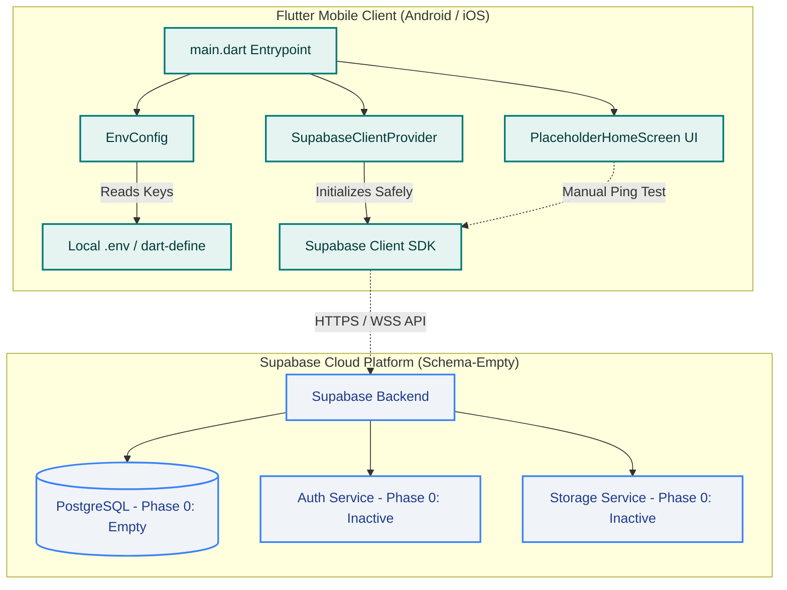

# PROJECT CONTEXT & LIVING ARCHITECTURE LOG

## Product Summary
Medico OPD Assistant is an AI-powered consultation documentation assistant built for medical doctors and outpatient clinics in India. The application captures clinical consultations, assists in generating structured clinical notes, prescriptions, and follow-up guidance, and securely stores medical records under Indian healthcare compliance standards. The system pairs a cross-platform mobile frontend (Android and iOS) with a scalable Supabase backend (PostgreSQL, Auth, and Storage).

---

## Current Status
- **Current Phase**: `PHASE-000: Project Foundation & Scaffolding`
- **Current Task ID**: `TASK-000-01`
- **Last Updated**: 2026-09-14

---

## Running Task Log

| Task ID | Date | Objective | What Was Built | Key Decisions & Deviations |
|---|---|---|---|---|
| **TASK-000-01** | 2026-09-14 | Greenfield project foundation & scaffolding | Initialized clean Flutter project (Android & iOS targets only), wired non-committed `.env` / `--dart-define` secret handling, added `supabase_flutter` initialization scaffold, created placeholder diagnostic home screen, wrote automated widget tests, established GitHub Actions CI pipeline, and created living documentation. | 1. Selected `flutter_dotenv` combined with `--dart-define` fallback for maximum developer ergonomics and CI flexibility.<br>2. Gracefully handled missing or placeholder credentials so that the skeleton launches safely without crashing when unconfigured.<br>3. Handled `anonKey` deprecation in `supabase_flutter 2.17.2` by using `publishableKey`. |

---

## Current Architecture Snapshot

### Technology Stack Choices & Rationales
- **Frontend Framework: Flutter (Channel `stable`, Dart SDK 3.13+)**
  - *Why*: Delivers a single, performant codebase for Android and iOS devices commonly used by medical practitioners across clinic environments.
- **Backend & Database: Supabase (`supabase_flutter: ^2.17.2`)**
  - *Why*: Offers managed PostgreSQL, built-in row-level security (RLS), authentication, and storage with robust Dart/Flutter SDK support. *Note: No tables, schemas, or auth policies exist in Phase 0.*
- **Configuration & Secrets: `flutter_dotenv: ^6.0.1` + `.env.example`**
  - *Why*: Completely isolates credentials from source control while providing a simple developer experience. All `.env` files are git-ignored, with fallback to compile-time defines (`--dart-define`).
- **Continuous Integration: GitHub Actions (`.github/workflows/ci.yml`)**
  - *Why*: Provides automated cross-platform checks on every push: Ubuntu runner for lint/formatting/test and Android debug APK build; macOS runner for iOS target build verification.

### Directory & File Structure
```
medico-opd/
├── .github/
│   └── workflows/
│       └── ci.yml               # Automated CI: lint, analyze, test, Android APK, iOS target
├── android/                     # Android native platform project (Gradle / Kotlin)
├── ios/                         # iOS native platform project (Xcode / Swift)
├── lib/
│   ├── core/
│   │   ├── config/
│   │   │   └── env_config.dart  # Centralized environment reader (.env & dart-define)
│   │   └── supabase/
│   │       └── supabase_client_provider.dart # Safe Supabase initialization wrapper
│   └── main.dart                # Application entrypoint & placeholder diagnostic shell
├── test/
│   └── widget_test.dart         # Unit & widget smoke tests
├── .env.example                 # Committed template for environment variables
├── .gitignore                   # Excludes .env, build artifacts, and sensitive files
├── pubspec.yaml                 # Dependencies and asset declarations
├── README.md                    # Developer setup and onboarding guide
└── PROJECT_CONTEXT.md           # Living architecture documentation (this file)
```

---

## Architecture Diagram



---

## Do Not Break (System Invariants)

Future phases and tasks must adhere to these inviolable constraints:
1. **Zero Secret Leaks**: Never commit `.env`, private keys, or service-role keys into git or CI configs. Only `.env.example` with dummy values may be committed.
2. **Graceful Degradation**: The client application must not crash on boot if backend keys are missing or invalid; it must display clear diagnostics instead.
3. **Platform Scope Discipline**: Targets are strictly mobile (`android` and `ios`). Do not re-add web, desktop, or extraneous platform directories unless explicitly ordered.
4. **Phase Boundary Discipline**:
   - Do **NOT** add authentication flows until the designated Auth phase.
   - Do **NOT** generate database tables or migrations until the designated Data Modeling phase.
   - Do **NOT** introduce recording, transcription, AI, or clinical modules until their scheduled phases.
5. **Living Context Maintenance**: `PROJECT_CONTEXT.md` must be updated on every single task completion, maintaining the running task log and updating the Mermaid diagram.
