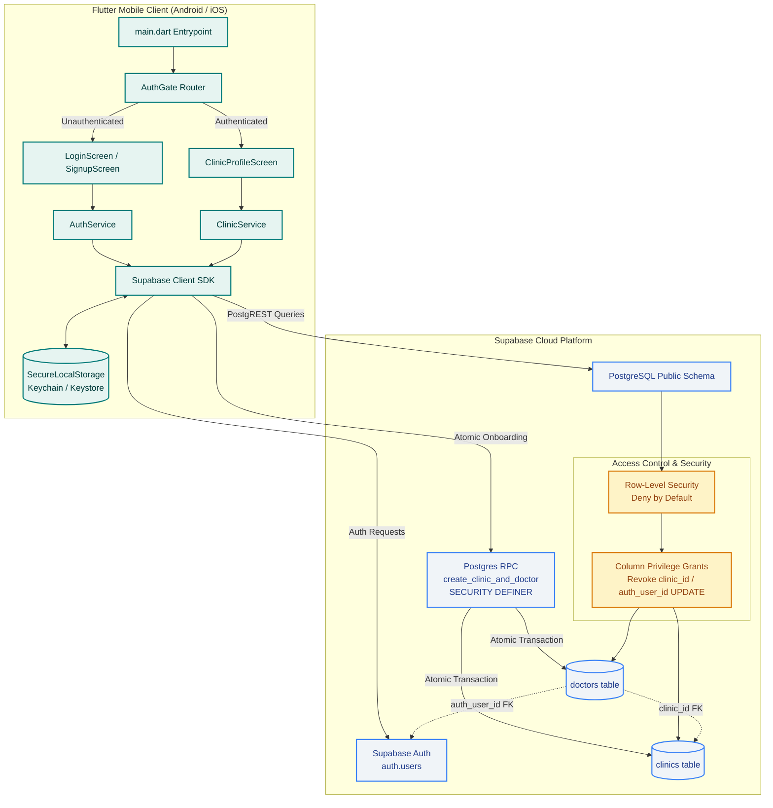

# PROJECT CONTEXT & LIVING ARCHITECTURE LOG

## Product Summary
Medico OPD Assistant is an AI-powered consultation documentation assistant built for medical doctors and outpatient clinics in India. The application captures clinical consultations, assists in generating structured clinical notes, prescriptions, and follow-up guidance, and securely stores medical records under Indian healthcare compliance standards. The system pairs a cross-platform mobile frontend (Android and iOS) with a scalable Supabase backend (PostgreSQL, Auth, and Storage).

---

## Current Status
- **Current Phase**: `PHASE-001: Auth, Clinic & Doctor Onboarding`
- **Current Task ID**: `TASK-001-01`
- **Last Updated**: 2026-09-15

---

## Running Task Log

| Task ID | Date | Objective | What Was Built | Key Decisions & Deviations |
|---|---|---|---|---|
| **TASK-000-01** | 2026-09-14 | Greenfield project foundation & scaffolding | Initialized clean Flutter project (Android & iOS targets only), wired non-committed `.env` / `--dart-define` secret handling, added `supabase_flutter` initialization scaffold, created placeholder diagnostic home screen, wrote automated widget tests, established GitHub Actions CI pipeline, and created living documentation. | 1. Selected `flutter_dotenv` combined with `--dart-define` fallback for maximum developer ergonomics and CI flexibility.<br>2. Gracefully handled missing or placeholder credentials so that the skeleton launches safely without crashing when unconfigured.<br>3. Handled `anonKey` deprecation in `supabase_flutter 2.17.2` by using `publishableKey`. |
| **TASK-000-02** | 2026-09-15 | Remote repository connection, CI pipeline verification, emulator screenshot capture, and lint recovery demonstration | Connected local scaffold to GitHub remote (Mayank-path/Medico-opd), reconciled remote MIT license, enhanced CI pipeline with automated Android emulator and iOS simulator screenshot capture, fixed runner disk exhaustion in Android CI via pre-execution cleanup, executed deliberate lint-fail and recovery demonstrations, and verified zero secret leakage. | 1. Reconciled remote repository MIT license via git fetch and merge commit without force-pushing.<br>2. Installed and authenticated GitHub CLI (gh) via device auth flow avoiding fragile token handling.<br>3. Identified runner disk exhaustion (System.IO.IOException: No space left on device) during Android emulator setup and resolved by stripping preinstalled .NET/Docker/NDK runner bloat with jlumbroso/free-disk-space.<br>4. Successfully captured iOS simulator and Android emulator UI screenshot artifacts verifying placeholder screen. |
| **TASK-001-01** | 2026-09-15 | Doctor signup/login/logout with clinic association, deny-by-default RLS, atomic onboarding RPC, and secure storage | Implemented PostgreSQL schema for clinics and doctors, configured deny-by-default RLS policies, column-level update privileges preventing tenant-hopping, atomic `create_clinic_and_doctor` `SECURITY DEFINER` RPC, `SecureLocalStorage` session persistence via `flutter_secure_storage`, `AuthService`, `ClinicService`, minimal Login/Signup/ClinicProfile UI, `AuthGate` routing, unit tests, and adversarial multi-tenant RLS test suite. | 1. Replaced sequential client-side insertions with atomic Postgres RPC function `create_clinic_and_doctor` to guarantee transaction atomicity and prevent orphaned clinics or auth records.<br>2. Removed standing client-side INSERT policy on clinics; clinic creation is restricted to the atomic RPC.<br>3. Implemented column-level update grants on doctors (restricting updates to full_name, qualifications, registration_number, contact_info) to completely prevent tenant-hopping via `clinic_id` mutation or `auth_user_id` hijacking.<br>4. Integrated `flutter_secure_storage` with Supabase `LocalStorage` for hardware-backed token encryption on Android and iOS. |

---

## Current Architecture Snapshot

### Technology Stack Choices & Rationales
- **Frontend Framework: Flutter (Channel `stable`, Dart SDK 3.13+)**
  - *Why*: Delivers a single, performant codebase for Android and iOS devices commonly used by medical practitioners across clinic environments.
- **Backend & Database: Supabase (`supabase_flutter: ^2.17.2`)**
  - *Why*: Offers managed PostgreSQL, built-in row-level security (RLS), authentication, and storage with robust Dart/Flutter SDK support.
  - *Phase 1 Tables*: `clinics` and `doctors` tables with strict deny-by-default RLS and column-level privileges.
- **Session & Token Storage: `flutter_secure_storage: ^9.2.4`**
  - *Why*: Stores Supabase JWT access and refresh tokens in hardware-backed secure storage (iOS Keychain and Android EncryptedSharedPreferences) rather than plain-text shared preferences.
- **Configuration & Secrets: `flutter_dotenv: ^6.0.1` + `.env.example`**
  - *Why*: Completely isolates credentials from source control while providing a simple developer experience. All `.env` files are git-ignored, with fallback to compile-time defines (`--dart-define`).
- **Continuous Integration: GitHub Actions (`.github/workflows/ci.yml`)**
  - *Why*: Provides automated cross-platform checks on every push: Ubuntu runner for lint/formatting/test and Android debug APK build; macOS runner for iOS target build verification.

### Directory & File Structure
```
medico-opd/
├── .github/
│   └── workflows/
│       └── ci.yml               # Automated CI: lint, analyze, test, Android APK, iOS target
├── android/                     # Android native platform project (Gradle / Kotlin)
├── ios/                         # iOS native platform project (Xcode / Swift)
├── lib/
│   ├── core/
│   │   ├── config/
│   │   │   └── env_config.dart  # Centralized environment reader (.env & dart-define)
│   │   └── supabase/
│   │       ├── secure_local_storage.dart     # Hardware-backed token storage
│   │       └── supabase_client_provider.dart # Safe Supabase initialization wrapper
│   ├── features/
│   │   ├── auth/
│   │   │   ├── screens/
│   │   │   │   ├── login_screen.dart         # Minimal doctor login screen
│   │   │   │   └── signup_screen.dart        # Doctor and clinic registration screen
│   │   │   └── services/
│   │   │       └── auth_service.dart         # Atomic signup, login, logout, sanitized errors
│   │   └── clinic/
│   │       ├── models/
│   │       │   ├── clinic_model.dart         # Clinic entity model
│   │       │   └── doctor_model.dart         # Doctor profile entity model
│   │       ├── screens/
│   │       │   └── clinic_profile_screen.dart# Logged-in doctor clinic dashboard
│   │       └── services/
│   │           └── clinic_service.dart       # Clinic and doctor data fetch/update
│   └── main.dart                # Application entrypoint & AuthGate router
├── supabase/
│   └── migrations/
│       └── 20260915000001_init_clinics_and_doctors.sql # DDL, RLS, column grants, atomic RPC
├── test/
│   ├── features/
│   │   └── auth/
│   │       └── auth_service_test.dart        # Auth validation and failure mode tests
│   ├── rls/
│   │   └── adversarial_rls_test.dart         # Multi-tenant RLS, column grant, atomicity tests
│   └── widget_test.dart         # UI smoke tests for AuthGate, Login, Signup, Profile
├── .env.example                 # Committed template for environment variables
├── .gitignore                   # Excludes .env, build artifacts, and sensitive files
├── pubspec.yaml                 # Dependencies and asset declarations
├── README.md                    # Developer setup and onboarding guide
└── PROJECT_CONTEXT.md           # Living architecture documentation (this file)
```

---

## Architecture Diagram



---

## Do Not Break (System Invariants)

Future phases and tasks must adhere to these inviolable constraints:
1. **Zero Secret Leaks**: Never commit `.env`, private keys, or service-role keys into git or CI configs. Only `.env.example` with dummy values may be committed.
2. **Graceful Degradation**: The client application must not crash on boot if backend keys are missing or invalid; it must display clear diagnostics instead.
3. **Platform Scope Discipline**: Targets are strictly mobile (`android` and `ios`). Do not re-add web, desktop, or extraneous platform directories unless explicitly ordered.
4. **Phase Boundary Discipline**:
   - Phase 1 scope is strictly `clinics` and `doctors`.
   - Do **NOT** generate patient, consultation, recording, transcription, AI, or clinical modules until their scheduled phases.
5. **Living Context Maintenance**: `PROJECT_CONTEXT.md` must be updated on every single task completion, maintaining the running task log and updating the Mermaid diagram.
6. **Multi-Tenant Security Invariants**:
   - All tables must have RLS enabled with deny-by-default.
   - Column grants must prevent tenant-hopping (doctors cannot reassign `clinic_id`).
   - Clinic onboarding must be atomic via `SECURITY DEFINER` RPC.
