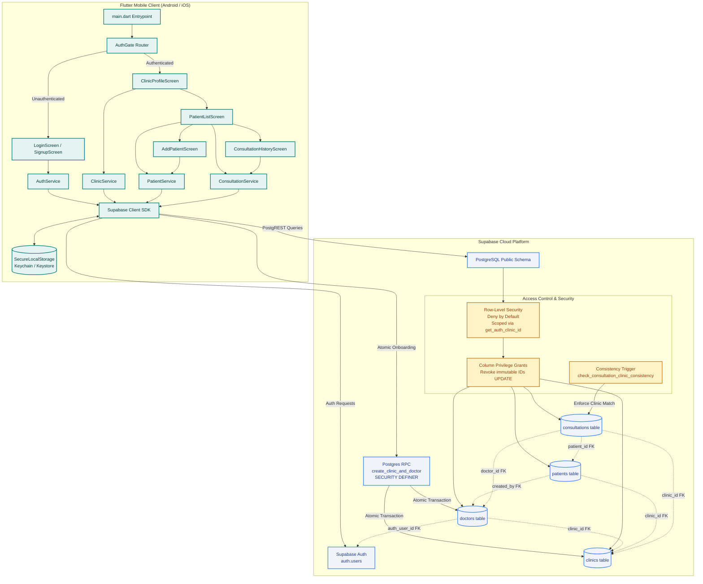

# PROJECT CONTEXT & LIVING ARCHITECTURE LOG

## Product Summary
Medico OPD Assistant is an AI-powered consultation documentation assistant built for medical doctors and outpatient clinics in India. The application captures clinical consultations, assists in generating structured clinical notes, prescriptions, and follow-up guidance, and securely stores medical records under Indian healthcare compliance standards. The system pairs a cross-platform mobile frontend (Android and iOS) with a scalable Supabase backend (PostgreSQL, Auth, and Storage).

---

## Current Status
- **Current Phase**: `PHASE-002: Patient & Consultation Data Model`
- **Current Task ID**: `TASK-002-01`
- **Last Updated**: 2026-09-17

---

## Running Task Log

| Task ID | Date | Objective | What Was Built | Key Decisions & Deviations |
|---|---|---|---|---|
| **TASK-000-01** | 2026-09-14 | Greenfield project foundation & scaffolding | Initialized clean Flutter project (Android & iOS targets only), wired non-committed `.env` / `--dart-define` secret handling, added `supabase_flutter` initialization scaffold, created placeholder diagnostic home screen, wrote automated widget tests, established GitHub Actions CI pipeline, and created living documentation. | 1. Selected `flutter_dotenv` combined with `--dart-define` fallback for maximum developer ergonomics and CI flexibility.<br>2. Gracefully handled missing or placeholder credentials so that the skeleton launches safely without crashing when unconfigured.<br>3. Handled `anonKey` deprecation in `supabase_flutter 2.17.2` by using `publishableKey`. |
| **TASK-000-02** | 2026-09-15 | Remote repository connection, CI pipeline verification, emulator screenshot capture, and lint recovery demonstration | Connected local scaffold to GitHub remote (Mayank-path/Medico-opd), reconciled remote MIT license, enhanced CI pipeline with automated Android emulator and iOS simulator screenshot capture, fixed runner disk exhaustion in Android CI via pre-execution cleanup, executed deliberate lint-fail and recovery demonstrations, and verified zero secret leakage. | 1. Reconciled remote repository MIT license via git fetch and merge commit without force-pushing.<br>2. Installed and authenticated GitHub CLI (gh) via device auth flow avoiding fragile token handling.<br>3. Identified runner disk exhaustion (System.IO.IOException: No space left on device) during Android emulator setup and resolved by stripping preinstalled .NET/Docker/NDK runner bloat with jlumbroso/free-disk-space.<br>4. Successfully captured iOS simulator and Android emulator UI screenshot artifacts verifying placeholder screen. |
| **TASK-001-01** | 2026-09-15 | Doctor signup/login/logout with clinic association, deny-by-default RLS, atomic onboarding RPC, and secure storage | Implemented PostgreSQL schema for clinics and doctors, configured deny-by-default RLS policies, column-level update privileges preventing tenant-hopping, atomic `create_clinic_and_doctor` `SECURITY DEFINER` RPC, `SecureLocalStorage` session persistence via `flutter_secure_storage`, `AuthService`, `ClinicService`, minimal Login/Signup/ClinicProfile UI, `AuthGate` routing, unit tests, and adversarial multi-tenant RLS test suite. | 1. Replaced sequential client-side insertions with atomic Postgres RPC function `create_clinic_and_doctor` to guarantee transaction atomicity and prevent orphaned clinics or auth records.<br>2. Removed standing client-side INSERT policy on clinics; clinic creation is restricted to the atomic RPC.<br>3. Implemented column-level update grants on doctors (restricting updates to full_name, qualifications, registration_number, contact_info) to completely prevent tenant-hopping via `clinic_id` mutation or `auth_user_id` hijacking.<br>4. Integrated `flutter_secure_storage` with Supabase `LocalStorage` for hardware-backed token encryption on Android and iOS. |
| **TASK-001-02** | 2026-09-15 | Remove unauthorized auto_confirm trigger & restore production email confirmation | Removed `auto_confirm_users` function and `on_auth_user_created` trigger from migration file and live database. Restored standard Supabase production email verification. Refactored adversarial test suite to provision pre-confirmed test users via test-scoped Supabase Admin API (`admin.createUser({ emailConfirm: true })`) with server-side `SUPABASE_SERVICE_ROLE_KEY`. | 1. Prohibited schema-level bypasses of authentication security controls.<br>2. Migrated adversarial test harness to use Supabase Admin API with test-scoped `service_role` key, completely isolating test user generation from production auth schema. |
| **TASK-001-03** | 2026-09-16 | Service role key security audit, deferred-onboarding failure recovery UX & atomicity testing (Section 4 screencap deferred) | Audited repository and CI workflows confirming zero service_role or API credential leaks. Updated adversarial RLS suite to gracefully skip in CI/local runs where `SUPABASE_SERVICE_ROLE_KEY` is not present, documenting that it is currently run locally by hand. Implemented `finalizePendingOnboarding` dual-recovery UX (transparent retry on sign-in and interactive "Account setup incomplete — tap to retry" UI in `ClinicProfileScreen`). Added automated failure-window and atomicity test suite (`deferred_onboarding_failure_test.dart`) proving rollback (0 clinics) and single-pair idempotency (exactly 1 clinic/doctor pair). Gated automated login credentials in `LoginScreen` behind compile-time `kDebugMode`. | 1. Audited git history and CI workflows; verified zero hardcoded keys or secret leaks in repo.<br>2. Implemented dual-recovery strategy in `AuthService` and `ClinicProfileScreen`: automatic retry during `signIn` plus explicit user-facing "Account setup incomplete" card with retry button.<br>3. Proved database transaction atomicity: partial RPC failures roll back cleanly with 0 clinics/doctors, and retry produces exactly one clinic/doctor pair without duplicates.<br>4. Confirmed `adversarial_rls_test.dart` is currently local-only as CI has no `SUPABASE_SERVICE_ROLE_KEY` configured.<br>5. Section 4 (CI screenshot capture) deliberately held pending TASK-001-04 (dedicated test Supabase project provisioning) to prevent polluting the production project with test accounts.<br>6. Wrapped auto-login credentials in `LoginScreen` with compile-time `kDebugMode` check for dead-code elimination in release builds. |
| **TASK-001-04** | 2026-09-16 | Dedicated test Supabase project, production isolation guardrail, fail-safe cleanup, and zero-leak verification | Separated testing from production. Migrated test harness to read exclusively from `SUPABASE_TEST_*` variables. Implemented Refinement 2 (self-updating URL-equality production guard) blocking test runs against production. Implemented Refinement 1 (cascade-safe FK deletion ordering in cleanup: auth user first, then clinic) preventing 23503 FK errors. Added pre/post-test baseline user count assertion and deliberate-failure cleanup verification test. Audited production users list (0 test accounts). Configured CI with test secrets isolation. | 1. Strict separation of test project (`medico-opd-test`) from production (`dyfrknwejqwilstcoytt`).<br>2. Self-updating production guard dynamically compares `SUPABASE_TEST_URL` against `EnvConfig.supabaseUrl` and throws `StateError` on equality.<br>3. Cascade-safe FK deletion ordering deletes auth user first (cascading doctor row) before deleting clinic, preventing foreign key restrict violations.<br>4. Zero tolerance for orphaned test accounts enforced via baseline count assertion.<br>5. Verified production dashboard has 0 remaining test accounts. |
| **TASK-001-03-S4** | 2026-09-16 | Automated CI device screen capture of authenticated `ClinicProfileScreen` on Android and iOS (PHASE-001 Final Closure) | Configured Android emulator and iOS simulator CI pipeline jobs to boot, auto-login via compile-time `kDebugMode` gate using test doctor credentials in isolated `medico-opd-test`, await live Supabase auth and RLS profile fetch, and capture real native screenshots (`screenshot_clinic_profile_android.png`, `screenshot_clinic_profile_ios.png`). Wired idempotent test doctor provisioning script (`test/tool/provision_ci_doctor_test.dart`) to ensure zero user count accumulation across CI runs. | 1. Verified native device capture via `adb exec-out screencap -p` and `xcrun simctl io screenshot` capturing real RLS-filtered profile data.<br>2. Gated CI credentials via GitHub Actions secrets and `--dart-define` exclusively against `medico-opd-test`, completely avoiding production credentials.<br>3. Idempotent test account handling: provisions `dr.rajesh.sharma.ci@medico-opd.in` once and reuses it across runs without user count leakage. |
| **TASK-002-01** | 2026-09-17 | Implement patients and consultations tables with RLS, clinic-consistency trigger, column grants, and minimal CRUD UI | Implemented `patients` and `consultations` PostgreSQL schema with deny-by-default RLS, cross-entity clinic consistency trigger `check_consultation_clinic_consistency`, column-scoped update privileges preventing client mutation of immutable identifiers (`clinic_id`, `created_by`, `doctor_id`, `patient_id`), `PatientModel`, `ConsultationModel`, `PatientService`, `ConsultationService`, `PatientListScreen`, `AddPatientScreen`, `ConsultationHistoryScreen`, updated `ClinicProfileScreen` navigation, unit/failure-mode test suite, extended adversarial RLS test suite (ADVERSARIAL 10-16) on `medico-opd-test`, and automated Android emulator / iOS simulator CI screenshot capture. | 1. Implemented cross-entity clinic consistency via `BEFORE INSERT OR UPDATE` trigger function on `consultations` ensuring `patient.clinic_id == NEW.clinic_id` AND `doctor.clinic_id == NEW.clinic_id`, strictly enforcing multi-tenant isolation at the DB layer.<br>2. Reused `get_auth_clinic_id()` for `patients` and `consultations` RLS policies without creating client-side bypasses.<br>3. Enforced column-level update grants revoking mutation of `clinic_id`, `created_by`, `doctor_id`, and `patient_id` post-creation.<br>4. Verified intentional design decision via ADVERSARIAL 16: within a clinic, any doctor may create records attributed to any colleague in the same clinic (intentional for cross-coverage, not a gap).<br>5. Upgraded CI screenshot workflow to capture ClinicProfileScreen, PatientListScreen, and ConsultationHistoryScreen on both Android emulator and iOS simulator. |

---

## Current Architecture Snapshot

### Technology Stack Choices & Rationales
- **Frontend Framework: Flutter (Channel `stable`, Dart SDK 3.13+)**
  - *Why*: Delivers a single, performant codebase for Android and iOS devices commonly used by medical practitioners across clinic environments.
- **Backend & Database: Supabase (`supabase_flutter: ^2.17.2`)**
  - *Why*: Offers managed PostgreSQL, built-in row-level security (RLS), authentication, and storage with robust Dart/Flutter SDK support.
  - *Phase 1 Tables*: `clinics` and `doctors` tables with strict deny-by-default RLS and column-level privileges.
  - *Phase 2 Tables*: `patients` and `consultations` tables with deny-by-default RLS, cross-entity clinic-consistency trigger (`check_consultation_clinic_consistency`), and column-scoped update privileges preventing client mutation of immutable identifiers (`clinic_id`, `created_by`, `doctor_id`, `patient_id`).
- **Session & Token Storage: `flutter_secure_storage: ^9.2.4`**
  - *Why*: Stores Supabase JWT access and refresh tokens in hardware-backed secure storage (iOS Keychain and Android EncryptedSharedPreferences) rather than plain-text shared preferences.
- **Configuration & Secrets: `flutter_dotenv: ^6.0.1` + `.env.example`**
  - *Why*: Completely isolates credentials from source control while providing a simple developer experience. All `.env` files are git-ignored, with fallback to compile-time defines (`--dart-define`).
- **Continuous Integration: GitHub Actions (`.github/workflows/ci.yml`)**
  - *Why*: Provides automated cross-platform checks on every push: Ubuntu runner for lint/formatting/test, Android debug APK build, and automated Android emulator / iOS simulator multi-screen capture (`ClinicProfileScreen`, `PatientListScreen`, `ConsultationHistoryScreen`).

### Directory & File Structure
```
medico-opd/
├── .github/
│   └── workflows/
│       └── ci.yml               # Automated CI: lint, analyze, test, Android APK, iOS target
├── android/                     # Android native platform project (Gradle / Kotlin)
├── ios/                         # iOS native platform project (Xcode / Swift)
├── lib/
│   ├── core/
│   │   ├── config/
│   │   │   └── env_config.dart  # Centralized environment reader (.env & dart-define)
│   │   └── supabase/
│   │       ├── secure_local_storage.dart     # Hardware-backed token storage
│   │       └── supabase_client_provider.dart # Safe Supabase initialization wrapper
│   ├── features/
│   │   ├── auth/
│   │   │   ├── screens/
│   │   │   │   ├── login_screen.dart         # Minimal doctor login screen
│   │   │   │   └── signup_screen.dart        # Doctor and clinic registration screen
│   │   │   └── services/
│   │   │       └── auth_service.dart         # Atomic signup, login, logout, sanitized errors
│   │   ├── clinic/
│   │   │   ├── models/
│   │   │   │   ├── clinic_model.dart         # Clinic entity model
│   │   │   │   └── doctor_model.dart         # Doctor profile entity model
│   │   │   ├── screens/
│   │   │   │   └── clinic_profile_screen.dart# Logged-in doctor clinic dashboard
│   │   │   └── services/
│   │   │       └── clinic_service.dart       # Clinic and doctor data fetch/update
│   │   ├── consultation/
│   │   │   ├── models/
│   │   │   │   └── consultation_model.dart   # Consultation entity model (draft, in_progress, completed)
│   │   │   ├── screens/
│   │   │   │   └── consultation_history_screen.dart # Chronological patient consultation history
│   │   │   └── services/
│   │   │       └── consultation_service.dart # Consultation CRUD & status updates
│   │   └── patient/
│   │       ├── models/
│   │       │   └── patient_model.dart        # Patient entity model
│   │       ├── screens/
│   │       │   ├── add_patient_screen.dart   # Patient intake / registration form
│   │       │   └── patient_list_screen.dart  # Clinic-scoped patient search & directory
│   │       └── services/
│   │           └── patient_service.dart      # Clinic-scoped patient queries and creation
│   └── main.dart                # Application entrypoint & AuthGate router
├── supabase/
│   └── migrations/
│       ├── 20260915000001_init_clinics_and_doctors.sql # Phase 1: Clinics, doctors, RLS, column grants, atomic RPC
│       └── 20260917000001_create_patients_and_consultations.sql # Phase 2: Patients, consultations, RLS, consistency trigger
├── test/
│   ├── features/
│   │   ├── auth/
│   │   │   ├── auth_service_test.dart        # Auth validation and failure mode tests
│   │   │   └── deferred_onboarding_failure_test.dart # Onboarding recovery tests
│   │   └── patient/
│   │       └── patient_consultation_test.dart# Patient and consultation unit/failure-mode tests
│   ├── rls/
│   │   └── adversarial_rls_test.dart         # Multi-tenant RLS, column grants, consistency trigger (16 adversarial cases)
│   ├── tool/
│   │   └── provision_ci_doctor_test.dart     # CI test doctor, patient & consultation provisioning
│   └── widget_test.dart         # UI smoke tests for AuthGate, Login, Signup, Profile, AddPatient
├── .env.example                 # Committed template for environment variables
├── .gitignore                   # Excludes .env, build artifacts, and sensitive files
├── pubspec.yaml                 # Dependencies and asset declarations
├── README.md                    # Developer setup and onboarding guide
└── PROJECT_CONTEXT.md           # Living architecture documentation (this file)
```

---

## Architecture Diagram



---

## Do Not Break (System Invariants)

Future phases and tasks must adhere to these inviolable constraints:
1. **Zero Secret Leaks**: Never commit `.env`, private keys, or service-role keys into git or CI configs. Only `.env.example` with dummy values may be committed.
2. **Graceful Degradation**: The client application must not crash on boot if backend keys are missing or invalid; it must display clear diagnostics instead.
3. **Platform Scope Discipline**: Targets are strictly mobile (`android` and `ios`). Do not re-add web, desktop, or extraneous platform directories unless explicitly ordered.
4. **Phase Boundary Discipline**:
   - Phase 1 scope is strictly `clinics` and `doctors`.
   - Phase 2 scope is strictly `patients` and `consultations`.
   - Do **NOT** implement recording, audio, transcription, AI, prescription generation, or clinical note templates until their scheduled phases.
5. **Living Context Maintenance**: `PROJECT_CONTEXT.md` must be updated on every single task completion, maintaining the running task log and updating the Mermaid diagram.
6. **Multi-Tenant Security Invariants**:
   - All tables must have RLS enabled with deny-by-default.
   - Column grants must prevent tenant-hopping (doctors cannot reassign `clinic_id`, `created_by`, `doctor_id`, or `patient_id`).
   - Clinic onboarding must be atomic via `SECURITY DEFINER` RPC.
   - Cross-entity consistency (e.g. consultation's `doctor_id` and `patient_id` belonging to the same `clinic_id`) must be strictly enforced at the database level via triggers, not trusted to frontend code.
   - Within a clinic, any doctor may create records attributed to any colleague in the same clinic; this is intentional for cross-coverage, not a gap.
7. **Auth Email Verification Integrity**:
   - Production auth email confirmation must never be bypassed by a schema change or trigger (such as `auto_confirm_users`).
   - Multi-tenant and adversarial integration tests requiring pre-confirmed accounts must exclusively use test-scoped admin harnesses (`supabase.auth.admin.createUser({ email_confirm: true })` with server-side `service_role` key), preserving real authentication security controls in production.
8. **Inviolable Production & Test Environment Separation**:
   - Automated tests, integration test harnesses, adversarial RLS suites, and CI screenshot pipelines must **NEVER** execute against the production Supabase database.
   - All tests interacting with a live Supabase backend must exclusively target a separate, dedicated test project (`medico-opd-test`) configured via `SUPABASE_TEST_URL`, `SUPABASE_TEST_ANON_KEY`, and `SUPABASE_TEST_SERVICE_ROLE_KEY`.
   - The test harness must enforce self-updating production guards comparing `SUPABASE_TEST_URL` against `SUPABASE_URL` and immediately fail if they match.
   - Test suites must clean up all generated test records using cascade-safe foreign-key ordering (consultations/patients, then auth user deletion cascading doctors, then clinics) and assert that post-test user counts return to pre-test baseline.


