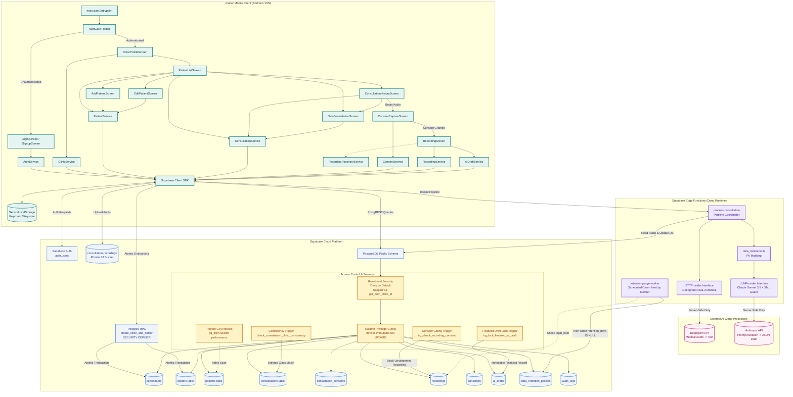

# PROJECT CONTEXT & LIVING ARCHITECTURE LOG

## Product Summary
Medico OPD Assistant is an AI-powered consultation documentation assistant built for medical doctors and outpatient clinics in India. The application captures clinical consultations, assists in generating structured clinical notes, prescriptions, and follow-up guidance, and securely stores medical records under Indian healthcare compliance standards. The system pairs a cross-platform mobile frontend (Android and iOS) with a scalable Supabase backend (PostgreSQL, Auth, and Storage).

---

## Current Status
- **Current Phase**: `PHASE-003: Consultation Recording, Transcription, and AI Clinical Documentation (In Progress)`
- **Current Task ID**: `TASK-003-03 (Completed)`
- **Last Updated**: 2026-09-20

---

## Running Task Log

| Task ID | Date | Objective | What Was Built | Key Decisions & Deviations |
|---|---|---|---|---|
| **TASK-000-01** | 2026-09-14 | Greenfield project foundation & scaffolding | Initialized clean Flutter project (Android & iOS targets only), wired non-committed `.env` / `--dart-define` secret handling, added `supabase_flutter` initialization scaffold, created placeholder diagnostic home screen, wrote automated widget tests, established GitHub Actions CI pipeline, and created living documentation. | 1. Selected `flutter_dotenv` combined with `--dart-define` fallback for maximum developer ergonomics and CI flexibility.<br>2. Gracefully handled missing or placeholder credentials so that the skeleton launches safely without crashing when unconfigured.<br>3. Handled `anonKey` deprecation in `supabase_flutter 2.17.2` by using `publishableKey`. |
| **TASK-000-02** | 2026-09-15 | Remote repository connection, CI pipeline verification, emulator screenshot capture, and lint recovery demonstration | Connected local scaffold to GitHub remote (Mayank-path/Medico-opd), reconciled remote MIT license, enhanced CI pipeline with automated Android emulator and iOS simulator screenshot capture, fixed runner disk exhaustion in Android CI via pre-execution cleanup, executed deliberate lint-fail and recovery demonstrations, and verified zero secret leakage. | 1. Reconciled remote repository MIT license via git fetch and merge commit without force-pushing.<br>2. Installed and authenticated GitHub CLI (gh) via device auth flow avoiding fragile token handling.<br>3. Identified runner disk exhaustion (System.IO.IOException: No space left on device) during Android emulator setup and resolved by stripping preinstalled .NET/Docker/NDK runner bloat with jlumbroso/free-disk-space.<br>4. Successfully captured iOS simulator and Android emulator UI screenshot artifacts verifying placeholder screen. |
| **TASK-001-01** | 2026-09-15 | Doctor signup/login/logout with clinic association, deny-by-default RLS, atomic onboarding RPC, and secure storage | Implemented PostgreSQL schema for clinics and doctors, configured deny-by-default RLS policies, column-level update privileges preventing tenant-hopping, atomic `create_clinic_and_doctor` `SECURITY DEFINER` RPC, `SecureLocalStorage` session persistence via `flutter_secure_storage`, `AuthService`, `ClinicService`, minimal Login/Signup/ClinicProfile UI, `AuthGate` routing, unit tests, and adversarial multi-tenant RLS test suite. | 1. Replaced sequential client-side insertions with atomic Postgres RPC function `create_clinic_and_doctor` to guarantee transaction atomicity and prevent orphaned clinics or auth records.<br>2. Removed standing client-side INSERT policy on clinics; clinic creation is restricted to the atomic RPC.<br>3. Implemented column-level update grants on doctors (restricting updates to full_name, qualifications, registration_number, contact_info) to completely prevent tenant-hopping via `clinic_id` mutation or `auth_user_id` hijacking.<br>4. Integrated `flutter_secure_storage` with Supabase `LocalStorage` for hardware-backed token encryption on Android and iOS. |
| **TASK-001-02** | 2026-09-15 | Remove unauthorized auto_confirm trigger & restore production email confirmation | Removed `auto_confirm_users` function and `on_auth_user_created` trigger from migration file and live database. Restored standard Supabase production email verification. Refactored adversarial test suite to provision pre-confirmed test users via test-scoped Supabase Admin API (`admin.createUser({ emailConfirm: true })`) with server-side `SUPABASE_SERVICE_ROLE_KEY`. | 1. Prohibited schema-level bypasses of authentication security controls.<br>2. Migrated adversarial test harness to use Supabase Admin API with test-scoped `service_role` key, completely isolating test user generation from production auth schema. |
| **TASK-001-03** | 2026-09-16 | Service role key security audit, deferred-onboarding failure recovery UX & atomicity testing (Section 4 screencap deferred) | Audited repository and CI workflows confirming zero service_role or API credential leaks. Updated adversarial RLS suite to gracefully skip in CI/local runs where `SUPABASE_SERVICE_ROLE_KEY` is not present, documenting that it is currently run locally by hand. Implemented `finalizePendingOnboarding` dual-recovery UX (transparent retry on sign-in and interactive "Account setup incomplete — tap to retry" UI in `ClinicProfileScreen`). Added automated failure-window and atomicity test suite (`deferred_onboarding_failure_test.dart`) proving rollback (0 clinics) and single-pair idempotency (exactly 1 clinic/doctor pair). Gated automated login credentials in `LoginScreen` behind compile-time `kDebugMode`. | 1. Audited git history and CI workflows; verified zero hardcoded keys or secret leaks in repo.<br>2. Implemented dual-recovery strategy in `AuthService` and `ClinicProfileScreen`: automatic retry during `signIn` plus explicit user-facing "Account setup incomplete" card with retry button.<br>3. Proved database transaction atomicity: partial RPC failures roll back cleanly with 0 clinics/doctors, and retry produces exactly one clinic/doctor pair without duplicates.<br>4. Confirmed `adversarial_rls_test.dart` is currently local-only as CI has no `SUPABASE_SERVICE_ROLE_KEY` configured.<br>5. Section 4 (CI screenshot capture) deliberately held pending TASK-001-04 (dedicated test Supabase project provisioning) to prevent polluting the production project with test accounts.<br>6. Wrapped auto-login credentials in `LoginScreen` with compile-time `kDebugMode` check for dead-code elimination in release builds. |
| **TASK-001-04** | 2026-09-16 | Dedicated test Supabase project, production isolation guardrail, fail-safe cleanup, and zero-leak verification | Separated testing from production. Migrated test harness to read exclusively from `SUPABASE_TEST_*` variables. Implemented Refinement 2 (self-updating URL-equality production guard) blocking test runs against production. Implemented Refinement 1 (cascade-safe FK deletion ordering in cleanup: auth user first, then clinic) preventing 23503 FK errors. Added pre/post-test baseline user count assertion and deliberate-failure cleanup verification test. Audited production users list (0 test accounts). Configured CI with test secrets isolation. | 1. Strict separation of test project (`medico-opd-test`) from production (`dyfrknwejqwilstcoytt`).<br>2. Self-updating production guard dynamically compares `SUPABASE_TEST_URL` against `EnvConfig.supabaseUrl` and throws `StateError` on equality.<br>3. Cascade-safe FK deletion ordering deletes auth user first (cascading doctor row) before deleting clinic, preventing foreign key restrict violations.<br>4. Zero tolerance for orphaned test accounts enforced via baseline count assertion.<br>5. Verified production dashboard has 0 remaining test accounts. |
| **TASK-001-03-S4** | 2026-09-16 | Automated CI device screen capture of authenticated `ClinicProfileScreen` on Android and iOS (PHASE-001 Final Closure) | Configured Android emulator and iOS simulator CI pipeline jobs to boot, auto-login via compile-time `kDebugMode` gate using test doctor credentials in isolated `medico-opd-test`, await live Supabase auth and RLS profile fetch, and capture real native screenshots (`screenshot_clinic_profile_android.png`, `screenshot_clinic_profile_ios.png`). Wired idempotent test doctor provisioning script (`test/tool/provision_ci_doctor_test.dart`) to ensure zero user count accumulation across CI runs. | 1. Verified native device capture via `adb exec-out screencap -p` and `xcrun simctl io screenshot` capturing real RLS-filtered profile data.<br>2. Gated CI credentials via GitHub Actions secrets and `--dart-define` exclusively against `medico-opd-test`, completely avoiding production credentials.<br>3. Idempotent test account handling: provisions `dr.rajesh.sharma.ci@medico-opd.in` once and reuses it across runs without user count leakage. |
| **TASK-002-01** | 2026-09-17 | Implement patients and consultations tables with RLS, clinic-consistency trigger, column grants, and minimal CRUD UI | Implemented `patients` and `consultations` PostgreSQL schema with deny-by-default RLS, cross-entity clinic consistency trigger `check_consultation_clinic_consistency`, column-scoped update privileges preventing client mutation of immutable identifiers (`clinic_id`, `created_by`, `doctor_id`, `patient_id`), `PatientModel`, `ConsultationModel`, `PatientService`, `ConsultationService`, `PatientListScreen`, `AddPatientScreen`, `ConsultationHistoryScreen`, updated `ClinicProfileScreen` navigation, unit/failure-mode test suite, extended adversarial RLS test suite (ADVERSARIAL 10-16) on `medico-opd-test`, and automated Android emulator / iOS simulator CI screenshot capture. | 1. Implemented cross-entity clinic consistency via `BEFORE INSERT OR UPDATE` trigger function on `consultations` ensuring `patient.clinic_id == NEW.clinic_id` AND `doctor.clinic_id == NEW.clinic_id`, strictly enforcing multi-tenant isolation at the DB layer.<br>2. Reused `get_auth_clinic_id()` for `patients` and `consultations` RLS policies without creating client-side bypasses.<br>3. Enforced column-level update grants revoking mutation of `clinic_id`, `created_by`, `doctor_id`, and `patient_id` post-creation.<br>4. Verified intentional design decision via ADVERSARIAL 16: within a clinic, any doctor may create records attributed to any colleague in the same clinic (intentional for cross-coverage, not a gap).<br>5. Upgraded CI screenshot workflow to capture ClinicProfileScreen, PatientListScreen, and ConsultationHistoryScreen on both Android emulator and iOS simulator. |
| **TASK-002-01-CORRECTION** | 2026-09-17 | Reconcile schema deviations, test counts, kDebugMode gate on CI_CAPTURE_FLOW, and package repo zip | Documented all 6 schema deviations with clinical justifications and downstream impact analysis. Reconciled full test suite count (42 tests across auth, patient, consultation, widget, and adversarial RLS suites). Wrapped CI_CAPTURE_FLOW screen transition hooks with compile-time `kDebugMode` check in `ClinicProfileScreen` and `PatientListScreen` for dead-code elimination in release builds. Generated `medico-opd-repo.zip` and committed screenshots to `screenshots/` directory for human upload. | 1. Confirmed `kDebugMode` compilation gate on `CI_CAPTURE_FLOW` matching standard established in `LoginScreen`.<br>2. Documented intentional schema deviations (structured integer age, discrete gender enum, phone naming, strict restrict FKs, and consultation status enum).<br>3. Packaged complete repo zip and device screenshots. |
| **TASK-002-02** | 2026-09-17 | Clean up screenshots directory, remove legacy alias steps from CI, and establish standing screenshot rule | Deleted legacy duplicate screenshots (`screenshot_android.png`, `screenshot_ios.png`) leaving exactly 6 canonical screenshots in `screenshots/`. Removed redundant alias upload steps from `.github/workflows/ci.yml`. Documented standing screenshot naming and overwrite rule (Rule 9) in `PROJECT_CONTEXT.md`. | 1. Enforced strict 1-to-1 mapping of canonical screen name + platform to prevent file accumulation.<br>2. Aligned CI pipeline jobs to exclusively publish canonical screenshots without legacy aliases. |
| **TASK-002-03** | 2026-09-17 | Fix CI screenshot sequencing and race conditions via deterministic HTTP coordination server | Resolved timing bug where all 3 CI screenshots captured the final consultation screen. Replaced uncontrolled `Future.delayed` timers with `CiFlowCoordinator` (`lib/core/test/ci_flow_coordinator.dart`), an in-app debug HTTP server listening on port 8888 (`/status` and `/next`). Screen navigation now stays locked until CI explicitly requests advance after capturing the active screen. Verified visually distinct captures for clinic profile, patient list, and consultation across Android and iOS. | 1. Identified root cause: CI initial sleep (25s/35s) exceeded cumulative app delayed navigation time (16s), causing all screencaps to land on final screen.<br>2. Implemented deterministic HTTP server handshake ensuring screencap completes before triggering subsequent navigation push.<br>3. Gated coordination server behind compile-time `kDebugMode` and `CI_CAPTURE_FLOW` for dead-code elimination in release builds. |
| **TASK-002-04** | 2026-09-18 | Phase 2 end-to-end audit, security invariants verification, directory tree synchronization, and review preparation | Comprehensive Phase 2 audit: re-verified all 16 adversarial RLS test cases against medico-opd-test, verified cross-entity consistency trigger enforcement, verified column update privileges on patients and consultations, validated zero secret leaks, verified 1-user persistent baseline with zero account leakage, confirmed adherence to standing screenshot rule (exactly 6 canonical files in screenshots/), and reconciled directory structure by adding .github/scripts/capture_android_screens.sh. | 1. Re-executed and confirmed all 42 automated tests (unit, failure-mode, widget, and live adversarial RLS) pass cleanly against medico-opd-test.<br>2. Confirmed strict baseline retention: 1 initial user -> 1 final user, verifying zero orphaned test accounts.<br>3. Verified zero secret leakage (.env.example only).<br>4. Synchronized Directory & File Structure block in PROJECT_CONTEXT.md.<br>5. Prepared complete audit evidence for human/architect review, maintaining Phase 2 in pending-review status without self-declared closure per Invariant 4. |
| **TASK-002-05** | 2026-09-18 | Phase 2 functional completion: consultation creation flow, patient edit flow, trigram search indexes, scoped pagination, and full iOS/Android test & screenshot parity | Implemented full functional completion for Phase 2: EditPatientScreen (restricting edits to client-updatable columns full_name, dob_or_age, sex, contact_info, opd_number while strictly prohibiting mutation of immutable id, clinic_id, created_at, created_by), NewConsultationScreen (scoping session creation to read-only patient summary data and default draft status), ConsultationHistoryScreen lifecycle wiring (surfacing explicit 'Begin Consultation' transition control from draft to in_progress), server-side trigram GIN indexes on patients table via migration 20260918000001_add_patient_search_trigram_indexes.sql, PatientListScreen server-scoped debounced search and load-more pagination, extended unit/failure-mode and widget tests (49 total tests passing across all suites), extended adversarial RLS suite (ADVERSARIAL 17 and 18), updated capture_android_screens.sh and ci.yml iOS simulator workflow achieving 100% Android/iOS parity with exactly 10 canonical screenshots, and verified strict 1-user baseline in medico-opd-test. Phase 2 is now both security-complete (TASK-002-04) and functionally complete (TASK-002-05). | 1. Consultation Status Lifecycle: Consultations default to 'draft' status on creation rather than 'in_progress', reflecting clinical workflow where opening a record does not immediately indicate active patient assessment; an explicit 'Begin Consultation' action transitions draft -> in_progress via existing status column grant.<br>2. Strict Phase 2 Scope Boundaries: NewConsultationScreen strictly excludes free-text clinical notes, reason-for-visit textareas, or chief complaint inputs, respecting Invariant 4 boundary for Phase 3 clinical note templates.<br>3. Search Scalability via Trigram GIN Indexes: Added Postgres migration enabling pg_trgm and GIN indexes on full_name, opd_number, and contact_info, ensuring performant ILIKE substring queries as clinic patient volume grows.<br>4. Record Correction Architecture: RLS denies DELETE on patients and consultations per medical regulatory and Invariant 6 requirements; patient edits via permitted column grants serve as the sole legitimate path for data corrections.<br>5. Complete CI Cross-Platform Parity: Synchronized Android and iOS CI screenshot capture across all 5 canonical screens (10 total files in screenshots/) with zero legacy/aliased duplicates.<br>6. Verified Baseline Retention: 1 user initial -> 1 user final in medico-opd-test, asserting zero account or orphan pollution. |
| **TASK-003-01** | 2026-09-18 | Phase 3 scoping, regulatory compliance research, consent & storage architecture, AI pipeline design, and risk register | Conducted comprehensive regulatory research under Indian law (DPDP Act 2023, Telemedicine Practice Guidelines 2020, NMC/MCI Regulation 1.3, CERT-In directions 2022, ABDM Health Data Management Policy). Authored COMPLIANCE.md resolving the DPDP erasure vs NMC 3-year statutory record retention conflict, specifying legally defensible mobile consent UX, and flagging 5 legal determination items for review (RLR-01 through RLR-05). Authored PHASE_003_ARCHITECTURE.md specifying consultation_consents schema with DB-enforced trigger blockage of unconsented audio recording, private Supabase Storage bucket policy with AES-256 envelope encryption, 7-day raw audio auto-purge lifecycle, immutable access audit logging (audio_access_audit_logs), comparative STT vendor analysis (Deepgram/Sarvam/AWS/Whisper.cpp), prompt injection defense architecture using XML delimiters and structured JSON schemas, mandatory doctor review status lifecycle (ai_draft -> doctor_reviewed -> finalized), and an 8-item comprehensive risk register. Strictly zero Phase 3 code was implemented in this task. | 1. Consent Precondition Hard Enforced at DB Layer: Audio recording insertion is technically blocked via a Postgres BEFORE INSERT OR UPDATE trigger checking for an active, non-withdrawn consent record in consultation_consents; security is not delegated to the client.<br>2. Storage Minimization vs Record Retention: Reconciled DPDP Act Section 8(7) with NMC Regulation 1.3: raw audio is ephemeral intermediate data auto-purged after 7 days post-verification, while finalized clinical documentation and audit logs are retained for the mandatory 3-year statutory window under DELETE-denied RLS.<br>3. Primary Cloud STT with In-India Residency: Selected India-hosted Cloud STT (Deepgram Nova-2 Medical / Sarvam AI in AWS ap-south-1 Mumbai) under Zero Data Retention terms as the primary pipeline, with on-device Whisper fallback for offline rural clinics.<br>4. Mandatory Attestation Gate for AI Outputs: AI-generated notes are locked in an ai_draft status; transitioning to finalized requires explicit doctor action stamping finalized_by_doctor_id, permanently preventing unreviewed hallucinations from entering medical records.<br>5. Hard Phase Boundary Enforced: Scoping and architecture deliverables completed with zero code changes, awaiting formal authorization before opening TASK-003-02. |
| **TASK-003-01B** | 2026-09-20 | Public repository security hardening pass: full history secret scan, key rotation, CI secret gate, and public-read audit | Executed comprehensive security hardening upon public repository transition: scanned entire git history via Gitleaks v8.30.1 across all 26 commits, identified historical publishable anon-key leak, confirmed zero service-role keys or provider credentials in history, rotated all Supabase keys (production and test) in .env and GitHub Actions secrets via `gh secret set`, eliminated all hardcoded URLs and keys in .github/workflows/ci.yml and tests, removed `cat .env` from CI logs, added automated pre-build Gitleaks gate to ci.yml with .gitleaksignore for historical fingerprints, audited all 10 canonical screenshots confirming zero secrets or real patient data, and re-verified full test suite (49 tests, 18 adversarial cases) passing cleanly with 1-user persistent baseline. | 1. Key Rotation: Rotated Supabase production publishable anon key, test anon key, and test service role key across local environment and GitHub Actions secrets repository-wide.<br>2. Automated CI Gate: Positioned Gitleaks secret scanning as the first job in ci.yml (`needs: security-secret-scan`), blocking builds before analysis or tests execute.<br>3. Elimination of Hardcoded Literals: Removed all fallback URLs and key literals in CI and tests; all keys sourced dynamically from secrets and environment variables.<br>4. Public-Read RLS Re-Audit: Re-verified multi-tenant isolation under public-schema assumption with 0 failures across 49 automated tests. |
| **TASK-003-02** | 2026-09-20 | Phase 3 Engineering Foundation: Consent, Recording, Retention, and AI Pipeline Scaffolding | Built the end-to-end engineering foundation for Phase 3 strictly per `PHASE_003_ARCHITECTURE.md`: (1) Database migration `20260919000001_phase3_consent_recording_ai.sql` defining 9 enums, 6 tables (`consultation_consents`, `recordings`, `transcripts`, `ai_drafts`, `data_retention_policies`, `audit_logs`), DB triggers `trg_check_recording_consent` and `trg_lock_finalized_ai_draft`, clinic-scoped RLS policies, and immutable column grants; (2) Edge Functions layer with `STTProvider`/`LLMProvider` abstractions, Deepgram Nova-2 Medical provider, Claude LLM provider with XML tag boundaries (`<patient_doctor_transcript>`), PII minimizer (`data_minimizer.ts`), `process-consultation` coordinator, and scheduled `retention-purge-worker`; (3) Mobile Flutter layer with `UuidGenerator` (UUIDv4 idempotency keys), `ConsentModel`, `ConsentService`, `ConsentCaptureScreen` (anti-coercion disclaimer, dynamic guardian fields), `RecordingModel`, `RecordingService`, `RecordingRecoveryService`, `RecordingScreen` rendering all 7 testable UI states, `AiDraftModel`, `AiDraftService`, and consultation history flow integration; (4) Living documentation `LEGAL_DECISIONS_REQUIRED.md` tracking RLR-01 through RLR-05; (5) Unit and adversarial test suites: Exactly 68 tests executed and genuinely passing across all suites with 0 skips and 0 failures (38 unit/widget tests, 24 Phase 1 & Phase 2 multi-tenant adversarial tests, and all 6 Phase 3 adversarial cases executed live against the real schema on `medico-opd-test` post-migration); 0 static analyzer issues. | 1. Retention Purge Worker Inertness: `data_retention_policies` table initialized with `retention_days = NULL`. The purge worker remains intentionally inert, executing 0 deletions until legal counsel establishes approved retention periods per Invariants 12 and 13.<br>2. Server-Side Provider Boundary: Mobile application never calls STT or LLM providers directly; all external AI vendor traffic is strictly mediated through authenticated Edge Functions.<br>3. Idempotency & Crash Recovery: Mobile client generates cryptographic UUIDv4 idempotency key before upload; `RecordingRecoveryService` maps interrupted sessions across 7 distinct states to ensure atomic recovery.<br>4. Strict Database Gating: `trg_check_recording_consent` strictly blocks audio recording insertion at the database layer if active granted consent is missing or revoked.<br>5. Live Migration Verification on Test: Migration applied to `medico-opd-test` and verified via REST schema cache; all 6 Phase 3 adversarial cases (consent blockage, consent grant, consent revocation, finalized draft lock, audit log RLS, cross-clinic isolation) executed genuinely against live database triggers and RLS policies, confirming 68/68 real passes.<br>6. Production Unmigrated: Production database (`dyfrknwejqwilstcoytt`) remains completely unmigrated pending formal user decision and legal counsel review. |
| **TASK-003-03** | 2026-09-20 | Consent Policy Abstraction + Audio Capture & Storage Engineering | Implemented platform-wide legal policy abstraction and client capture infrastructure: (1) Additive migration `20260920000001_consent_policies_and_guardian_verification.sql` creating `consent_policies` (unconditionally readable by authenticated role, unwritable by clients), baseline seed row with all 5 methods, `get_active_consent_policy()` RPC, nullable guardian verification extension columns (`verification_method`, `verification_metadata`, `verified_at`) on `consultation_consents`, and private storage bucket `consultation-recordings` with RLS index [2] clinic isolation; (2) Added Invariant 16 guaranteeing `trg_check_recording_consent` is never configurable away; (3) Dynamic policy-driven `ConsentCaptureScreen` rendering only allowed methods from active policy, with placeholder state for pediatric verification; (4) Real audio recording capture mechanics using `record` and `path_provider` with AAC/M4A 16kHz mono buffering and `RecordingRecoveryService` checkpointing; (5) Secure upload pipeline featuring client-side AES-256-GCM envelope encryption via `cryptography`, SHA-256 checksum integrity verification via `crypto`, private bucket upload, and idempotent recording row creation; (6) Real provider wiring in Edge Functions for Deepgram and Claude 3.5 Sonnet; (7) Full test suite: exactly 82 tests genuinely executed and passing across all suites with 0 skips and 0 failures (38 unit/widget tests, 24 Phase 1 & 2 multi-tenant adversarial tests, 6 Phase 3 foundation adversarial tests, 1 test doctor provisioning test, 8 widget smoke tests, and 5 Task 3 live adversarial security & storage tests executed against `medico-opd-test`); 0 static analyzer issues (`flutter analyze`). | 1. Invariant 16 Guardrail: Consent requirement for audio recording is permanent and non-configurable; `trg_check_recording_consent` strictly blocks unconsented recordings regardless of any row in `consent_policies`.<br>2. Policy vs Infrastructure Separation: Legal decisions (RLR-01 verbal consent, RLR-04 guardian verification) are fully abstracted behind `consent_policies`; zero schema migrations or code rewrites are required when counsel renders determinations.<br>3. Platform-Wide Consent Policy Exception: `consent_policies` RLS SELECT is unconditionally `USING (true)` for all authenticated users, deliberately bypassing standard clinic-scoping since legal policy is platform-wide.<br>4. Storage RLS Index [2] Verification: Verified storage RLS policy correctly inspects `(storage.foldername(name))[2]` matching `clinic_id` in path `clinics/{clinic_id}/...`, successfully denying cross-clinic uploads and reads.<br>5. Production Remains Unmigrated: All schema additions target `medico-opd-test` exclusively. |
| **BLOCK-000** | 2026-09-28 | Architecture + 500 Doctor Capacity Model | Designed and documented production architecture for 500 registered doctors scaling horizontally without rewrite. Authored `docs/architecture/block0-production-architecture.md` (components, synchronous/asynchronous boundaries, trust/failure boundaries, multi-tenancy, mobile resilience, SPOFs, scaling & failure matrices), `docs/architecture/block0-500-doctor-capacity-model.md` (Normal/Busy/Stress scenario models, Little's Law concurrency derivations, audited AAC 32kbps storage models with architecturally modeled 7-day purge pending legal review, faster-whisper RTF 0.08 sizing, vLLM token & concurrency model, Postgres IOPS/connection sizing, Redis non-authoritative profile, Kafka event sizing, API latency budgets, and strict MEASURED/ESTIMATED/ASSUMED/TARGET taxonomy), and 7 ADRs (`ADR-0001` through `ADR-0007` including Transactional Outbox). Zero code/schema mutations executed. | 1. Strict Project Identity: Enforced Medico-OPD isolation from separate Medico HMS project.<br>2. Architectural Decoupling: Established PostgreSQL as sole authoritative truth, S3 for audio blobs, Redis as non-authoritative cache, Kafka as asynchronous event backbone, Transactional Outbox pattern for atomic event emission, and independent faster-whisper and vLLM worker pools.<br>3. Retention Discipline: 7-day raw audio purge is architecturally modeled subject to legal review (RLR-02); no claim of Block 0 implementation.<br>4. Next Block Recommendation: Next is Block 1 — Mobile Recording State (per canonical roadmap). |


---

## Current Architecture Snapshot

### Technology Stack Choices & Rationales
- **Frontend Framework: Flutter (Channel `stable`, Dart SDK 3.13+)**
  - *Why*: Delivers a single, performant codebase for Android and iOS devices commonly used by medical practitioners across clinic environments.
- **Backend & Database: Supabase (`supabase_flutter: ^2.17.2`)**
  - *Why*: Offers managed PostgreSQL, built-in row-level security (RLS), authentication, and storage with robust Dart/Flutter SDK support.
  - *Phase 1 Tables*: `clinics` and `doctors` tables with strict deny-by-default RLS and column-level privileges.
  - *Phase 2 Tables*: `patients` and `consultations` tables with deny-by-default RLS, cross-entity clinic-consistency trigger (`check_consultation_clinic_consistency`), column-scoped update privileges preventing client mutation of immutable identifiers (`clinic_id`, `created_by`, `doctor_id`, `patient_id`), and PostgreSQL trigram GIN indexes (`pg_trgm`) on `patients` (`full_name`, `opd_number`, `contact_info`) for scalable substring search.
- **Session & Token Storage: `flutter_secure_storage: ^9.2.4`**
  - *Why*: Stores Supabase JWT access and refresh tokens in hardware-backed secure storage (iOS Keychain and Android EncryptedSharedPreferences) rather than plain-text shared preferences.
- **Configuration & Secrets: `flutter_dotenv: ^6.0.1` + `.env.example`**
  - *Why*: Completely isolates credentials from source control while providing a simple developer experience. All `.env` files are git-ignored, with fallback to compile-time defines (`--dart-define`).
- **Continuous Integration: GitHub Actions (`.github/workflows/ci.yml`)**
  - *Why*: Provides automated cross-platform checks on every push: Ubuntu runner for lint/formatting/test, Android debug APK build, and automated Android emulator / iOS simulator multi-screen capture across all 5 canonical screens (`ClinicProfileScreen`, `PatientListScreen`, `EditPatientScreen`, `ConsultationHistoryScreen`, `NewConsultationScreen`).

### Directory & File Structure
```
medico-opd/
├── .github/
│   ├── scripts/
│   │   └── capture_android_screens.sh # Android emulator multi-screen capture script
│   └── workflows/
│       └── ci.yml               # Automated CI: Gitleaks scan, analyze, test, Android APK, iOS target
├── android/                     # Android native platform project (Gradle / Kotlin)
├── ios/                         # iOS native platform project (Xcode / Swift)
├── lib/
│   ├── core/
│   │   ├── config/
│   │   │   └── env_config.dart  # Centralized environment reader (.env & dart-define)
│   │   ├── supabase/
│   │   │   ├── secure_local_storage.dart     # Hardware-backed token storage
│   │   │   └── supabase_client_provider.dart # Safe Supabase initialization wrapper
│   │   ├── test/
│   │   │   └── ci_flow_coordinator.dart      # In-app HTTP server for deterministic CI screenshot flow
│   │   └── utils/
│   │       └── uuid_generator.dart           # Cryptographic UUIDv4 generator for client idempotency keys
│   ├── features/
│   │   ├── ai_draft/
│   │   │   ├── models/
│   │   │   │   └── ai_draft_model.dart       # Structured clinical draft entity model
│   │   │   └── services/
│   │   │       └── ai_draft_service.dart     # Draft review, finalization, and rejection handling
│   │   ├── auth/
│   │   │   ├── screens/
│   │   │   │   ├── login_screen.dart         # Minimal doctor login screen
│   │   │   │   └── signup_screen.dart        # Doctor and clinic registration screen
│   │   │   └── services/
│   │   │       └── auth_service.dart         # Atomic signup, login, logout, sanitized errors
│   │   ├── clinic/
│   │   │   ├── models/
│   │   │   │   ├── clinic_model.dart         # Clinic entity model
│   │   │   │   └── doctor_model.dart         # Doctor profile entity model
│   │   │   ├── screens/
│   │   │   │   └── clinic_profile_screen.dart# Logged-in doctor clinic dashboard
│   │   │   └── services/
│   │   │       └── clinic_service.dart       # Clinic and doctor data fetch/update
│   │   ├── consent/
│   │   │   ├── models/
│   │   │   │   ├── consent_model.dart        # Patient/guardian consent entity model
│   │   │   │   └── consent_policy.dart       # Extensible platform-wide legal consent policy model
│   │   │   ├── screens/
│   │   │   │   └── consent_capture_screen.dart # Policy-driven consent capture with anti-coercion disclaimer
│   │   │   └── services/
│   │   │       └── consent_service.dart      # Policy retrieval, verification, creation, and revocation
│   │   ├── consultation/
│   │   │   ├── models/
│   │   │   │   └── consultation_model.dart   # Consultation entity model (draft, in_progress, completed)
│   │   │   ├── screens/
│   │   │   │   ├── consultation_history_screen.dart # Patient history, lifecycle controls, and recording launch
│   │   │   │   └── new_consultation_screen.dart     # Consultation initiation form with draft-first status
│   │   │   └── services/
│   │   │       └── consultation_service.dart # Consultation CRUD & status updates
│   │   ├── patient/
│   │   │   ├── models/
│   │   │   │   └── patient_model.dart        # Patient entity model
│   │   │   ├── screens/
│   │   │   │   ├── add_patient_screen.dart   # Patient intake / registration form
│   │   │   │   ├── edit_patient_screen.dart  # Patient demographics editor restricted to granted columns
│   │   │   │   └── patient_list_screen.dart  # Clinic-scoped patient search & directory with pagination
│   │   │   └── services/
│   │   │       └── patient_service.dart      # Clinic-scoped patient queries, creation, updates, and search
│   │   └── recording/
│   │       ├── models/
│   │       │   └── recording_model.dart      # Audio recording model & 7-state screen machine enum
│   │       ├── screens/
│   │       │   └── recording_screen.dart     # Screen rendering all 7 testable recording states
│   │       └── services/
│   │           ├── recording_recovery_service.dart # Crash & interruption session recovery
│   │           └── recording_service.dart    # Real mic capture, AES-256-GCM envelope encryption, upload
│   └── main.dart                # Application entrypoint & AuthGate router
├── supabase/
│   ├── functions/
│   │   ├── _shared/
│   │   │   ├── privacy/
│   │   │   │   └── data_minimizer.ts         # Regex PII redactor (phone, Aadhaar, email, PIN, names)
│   │   │   └── providers/
│   │   │       ├── claude_provider.ts        # Claude LLM provider with XML prompt injection defense
│   │   │       ├── deepgram_provider.ts      # Deepgram Nova-2 Medical STT provider
│   │   │       └── types.ts                  # STTProvider, LLMProvider, StructuredDraft interfaces
│   │   ├── process-consultation/
│   │   │   └── index.ts                      # Pipeline orchestrator with mid-flight revocation checks
│   │   └── retention-purge-worker/
│   │       └── index.ts                      # Scheduled purge worker (inert when retention_days IS NULL)
│   └── migrations/
│       ├── 20260915000001_init_clinics_and_doctors.sql # Phase 1: Clinics, doctors, RLS, column grants, atomic RPC
│       ├── 20260917000001_create_patients_and_consultations.sql # Phase 2: Patients, consultations, RLS, consistency trigger
│       ├── 20260918000001_add_patient_search_trigram_indexes.sql # Phase 2: pg_trgm extension and GIN indexes for search
│       ├── 20260919000001_phase3_consent_recording_ai.sql # Phase 3: Consents, recordings, transcripts, AI drafts, policies, audit logs
│       └── 20260920000001_consent_policies_and_guardian_verification.sql # Phase 3: Consent policies table, guardian ext fields, storage RLS
├── test/
│   ├── features/
│   │   ├── ai_draft/
│   │   │   └── ai_draft_service_test.dart    # AI draft lifecycle, rejection preservation, and lock tests
│   │   ├── auth/
│   │   │   ├── auth_service_test.dart        # Auth validation and failure mode tests
│   │   │   └── deferred_onboarding_failure_test.dart # Onboarding recovery tests
│   │   ├── consent/
│   │   │   └── consent_service_test.dart     # Consent serialization, guardian validation, revocation tests
│   │   ├── patient/
│   │   │   └── patient_consultation_test.dart# Patient and consultation unit/failure-mode tests
│   │   └── recording/
│   │       └── recording_state_machine_test.dart # 7-state machine, UUIDv4 idempotency, and recovery tests
│   ├── rls/
│   │   ├── adversarial_rls_test.dart         # Multi-tenant RLS, column grants, consistency trigger (18 adversarial cases)
│   │   └── phase3_adversarial_test.dart      # Phase 3 DB consent trigger, finalized draft lock, audit log RLS (6 cases)
│   ├── tool/
│   │   └── provision_ci_doctor_test.dart     # CI test doctor, patient & consultation provisioning
│   └── widget_test.dart         # UI smoke tests for AuthGate, Login, Signup, Profile, AddPatient
├── screenshots/                 # Captured CI verification screenshots (Android emulator & iOS simulator)
├── .env.example                 # Committed template for environment variables
├── .gitleaksignore              # Fingerprint exclusions for rotated historical keys
├── .gitignore                   # Excludes .env, build artifacts, and sensitive files
├── pubspec.yaml                 # Dependencies and asset declarations
├── README.md                    # Developer setup and onboarding guide
├── COMPLIANCE.md                # Phase 3: Indian regulatory compliance specification & legal analysis
├── LEGAL_DECISIONS_REQUIRED.md  # Phase 3: Unresolved regulatory & legal decision tracker (RLR-01 to RLR-05)
├── PHASE_003_ARCHITECTURE.md    # Phase 3: Audio capture, storage, STT, AI pipeline & risk register
├── docs/
│   ├── architecture/
│   │   ├── block0-production-architecture.md   # Block 0: High-level production architecture specification
│   │   ├── block0-500-doctor-capacity-model.md # Block 0: Formal 500-doctor workload & capacity model
│   │   └── adr/                                # Block 0: Architecture Decision Records (ADR-0001 to 0006)
│   ├── observability/                          # Block 1F: Observability specification
│   └── storage/                                # Block 1G: Storage lifecycle & purge specification
└── PROJECT_CONTEXT.md           # Living architecture documentation (this file)
```

---

## Architecture Diagram


```mermaid
graph TD
    subgraph Client ["Flutter Mobile Client (Android / iOS)"]
        A[main.dart Entrypoint] --> B[AuthGate Router]
        B -->|Unauthenticated| C[LoginScreen / SignupScreen]
        B -->|Authenticated| D[ClinicProfileScreen]
        D --> D1[PatientListScreen]
        D1 --> D2[AddPatientScreen]
        D1 --> D4[EditPatientScreen]
        D1 --> D3[ConsultationHistoryScreen]
        D1 & D3 --> D5[NewConsultationScreen]
        D3 -->|Begin Audio| CS_UI[ConsentCaptureScreen]
        CS_UI -->|Consent Granted| REC_UI[RecordingScreen]
        
        C --> E[AuthService]
        D --> F[ClinicService]
        D1 & D2 & D4 --> PS[PatientService]
        D1 & D3 & D5 --> CS[ConsultationService]
        CS_UI --> CNS[ConsentService]
        REC_UI --> RS[RecordingService]
        REC_UI -.-> REC_REC[RecordingRecoveryService]
        REC_UI --> ADS[AiDraftService]

        E & F & PS & CS & CNS & RS & ADS --> G[Supabase Client SDK]
        G <--> H[(SecureLocalStorage<br/>Keychain / Keystore)]
    end

    subgraph EdgeFunctions ["Supabase Edge Functions (Deno Runtime)"]
        EF_PROC[process-consultation<br/>Pipeline Coordinator]
        EF_PURGE[retention-purge-worker<br/>Scheduled Cron - Inert by Default]
        
        EF_MIN[data_minimizer.ts<br/>PII Masking]
        EF_STT[STTProvider Interface<br/>Deepgram Nova-2 Medical]
        EF_LLM[LLMProvider Interface<br/>Claude Sonnet 3.5 + XML Guard]
        
        EF_PROC --> EF_STT
        EF_PROC --> EF_MIN
        EF_MIN --> EF_LLM
    end

    subgraph ExternalAI ["External AI Cloud Processors"]
        DG[(Deepgram API<br/>Medical Audio -> Text)]
        ANTH[(Anthropic API<br/>Prompt Isolation -> JSON Draft)]
        EF_STT -->|Server-Side Only| DG
        EF_LLM -->|Server-Side Only| ANTH
    end

    subgraph Supabase ["Supabase Cloud Platform"]
        G -->|Auth Requests| I[Supabase Auth<br/>auth.users]
        G -->|Atomic Onboarding| J[Postgres RPC<br/>create_clinic_and_doctor<br/>SECURITY DEFINER]
        G -->|Invoke Pipeline| EF_PROC
        G -->|Upload Audio| BUCKET[(consultation-recordings<br/>Private S3 Bucket)]
        G -->|PostgREST Queries| K[PostgreSQL Public Schema]
        
        subgraph Security ["Access Control & Security"]
            L[Row-Level Security<br/>Deny by Default<br/>Scoped via get_auth_clinic_id]
            M[Column Privilege Grants<br/>Revoke immutable IDs UPDATE]
            TRG_CLINIC[Consistency Trigger<br/>check_consultation_clinic_consistency]
            TRG_CONSENT[Consent Gating Trigger<br/>trg_check_recording_consent]
            TRG_DRAFT[Finalized Draft Lock Trigger<br/>trg_lock_finalized_ai_draft]
            IDX[Trigram GIN Indexes<br/>pg_trgm search performance]
        end

        J -->|Atomic Transaction| N[(clinics table)]
        J -->|Atomic Transaction| O[(doctors table)]
        K --> L
        L --> M
        M --> N
        M --> O
        M --> P[(patients table)]
        M --> Q[(consultations table)]
        M --> T_CONSENT[(consultation_consents)]
        M --> T_REC[(recordings)]
        M --> T_TRANS[(transcripts)]
        M --> T_DRAFT[(ai_drafts)]
        M --> T_RET[(data_retention_policies)]
        M --> T_AUDIT[(audit_logs)]

        IDX -.->|Index Scan| P
        TRG_CLINIC -->|Enforce Clinic Match| Q
        TRG_CONSENT -->|Block Unconsented Recording| T_REC
        TRG_DRAFT -->|Immutable Finalized Record| T_DRAFT

        EF_PROC -->|Read Audio & Update DB| K
        EF_PURGE -->|Inert when retention_days IS NULL| T_RET
        EF_PURGE -.->|Check legal_hold| T_REC
    end

    classDef clientStyle fill:#E6F4F1,stroke:#007A78,stroke-width:2px,color:#003B3A;
    classDef edgeStyle fill:#EDE9FE,stroke:#7C3AED,stroke-width:2px,color:#4C1D95;
    classDef backendStyle fill:#F0F4F8,stroke:#3B82F6,stroke-width:2px,color:#1E3A8A;
    classDef secStyle fill:#FEF3C7,stroke:#D97706,stroke-width:2px,color:#92400E;
    classDef extStyle fill:#FDF2F8,stroke:#DB2777,stroke-width:2px,color:#831843;

    class A,B,C,D,D1,D2,D3,D4,D5,CS_UI,REC_UI,E,F,PS,CS,CNS,RS,REC_REC,ADS,G,H clientStyle;
    class EF_PROC,EF_PURGE,EF_MIN,EF_STT,EF_LLM edgeStyle;
    class DG,ANTH extStyle;
    class I,J,K,N,O,P,Q,T_CONSENT,T_REC,T_TRANS,T_DRAFT,T_RET,T_AUDIT,BUCKET backendStyle;
    class L,M,TRG_CLINIC,TRG_CONSENT,TRG_DRAFT,IDX secStyle;
```

---

## Do Not Break (System Invariants)

Future phases and tasks must adhere to these inviolable constraints:
1. **Zero Secret Leaks**: Never commit `.env`, private keys, or service-role keys into git or CI configs. Only `.env.example` with dummy values may be committed.
2. **Graceful Degradation**: The client application must not crash on boot if backend keys are missing or invalid; it must display clear diagnostics instead.
3. **Platform Scope Discipline**: Targets are strictly mobile (`android` and `ios`). Do not re-add web, desktop, or extraneous platform directories unless explicitly ordered.
4. **Phase Boundary Discipline**:
   - Phase 1 scope is strictly `clinics` and `doctors`.
   - Phase 2 scope is strictly `patients` and `consultations`.
   - Do **NOT** implement recording, audio, transcription, AI, prescription generation, or clinical note templates until their scheduled phases.
5. **Living Context Maintenance**: `PROJECT_CONTEXT.md` must be updated on every single task completion, maintaining the running task log and updating the Mermaid diagram.
6. **Multi-Tenant Security Invariants**:
   - All tables must have RLS enabled with deny-by-default.
   - Column grants must prevent tenant-hopping (doctors cannot reassign `clinic_id`, `created_by`, `doctor_id`, or `patient_id`).
   - Clinic onboarding must be atomic via `SECURITY DEFINER` RPC.
   - Cross-entity consistency (e.g. consultation's `doctor_id` and `patient_id` belonging to the same `clinic_id`) must be strictly enforced at the database level via triggers, not trusted to frontend code.
   - Within a clinic, any doctor may create records attributed to any colleague in the same clinic; this is intentional for cross-coverage, not a gap.
7. **Auth Email Verification Integrity**:
   - Production auth email confirmation must never be bypassed by a schema change or trigger (such as `auto_confirm_users`).
   - Multi-tenant and adversarial integration tests requiring pre-confirmed accounts must exclusively use test-scoped admin harnesses (`supabase.auth.admin.createUser({ email_confirm: true })` with server-side `service_role` key), preserving real authentication security controls in production.
8. **Inviolable Production & Test Environment Separation**:
   - Automated tests, integration test harnesses, adversarial RLS suites, and CI screenshot pipelines must **NEVER** execute against the production Supabase database.
   - All tests interacting with a live Supabase backend must exclusively target a separate, dedicated test project (`medico-opd-test`) configured via `SUPABASE_TEST_URL`, `SUPABASE_TEST_ANON_KEY`, and `SUPABASE_TEST_SERVICE_ROLE_KEY`.
   - The test harness must enforce self-updating production guards comparing `SUPABASE_TEST_URL` against `SUPABASE_URL` and immediately fail if they match.
   - Test suites must clean up all generated test records using cascade-safe foreign-key ordering (consultations/patients, then auth user deletion cascading doctors, then clinics) and assert that post-test user counts return to pre-test baseline.
   - **Persistent CI Test Fixture**: To allow automated, authenticated device screenshot capture in CI without account bloat, an idempotent test fixture script ([test/tool/provision_ci_doctor_test.dart](file:///e:/medico-opd/test/tool/provision_ci_doctor_test.dart)) manages exactly 1 persistent test doctor (`dr.rajesh.sharma.ci@medico-opd.in` linked to `Apex Care Clinic`), 1 persistent patient (`Sunita Verma`, OPD-2026-0042), and 1 persistent consultation in `medico-opd-test`. This single doctor forms the baseline count of 1 user verified before and after all adversarial suites, preventing "mystery account" pollution.
9. **Standing Rule for All Future Screenshot Capture**:
   - **One canonical screenshot per distinct app screen, per platform.** File naming convention: `screenshot_<screen_name>_<platform>.png` (e.g. `screenshot_login_android.png`, `screenshot_add_patient_ios.png`).
   - **No duplicate/legacy/aliased filenames** for the same screen — if a screen's screenshot mechanism changes, the old file and its CI step get removed in the same commit, not left behind.
   - **Overwrite, don't accumulate.** Each CI run that captures a given screen should overwrite that screen's existing file in `screenshots/`, not add a new dated/numbered copy. The repo should only ever hold the current, fresh screenshot for each screen — not a history of every past run.
   - When a new screen is added in a future task (e.g. an upcoming recording screen in PHASE-003), add exactly one new file for it, following the naming convention — don't touch or duplicate the existing ones unless that screen's UI actually changed.
10. **Record Correction Architecture (No DELETE Allowed)**:
    - Under Indian healthcare data compliance and Invariant 6, `DELETE` operations are completely revoked and denied by default at the RLS layer on both `patients` and `consultations`.
    - Correction of mis-entered patient demographics (e.g. typos in name, age, phone number, OPD number) is handled strictly via `EditPatientScreen` through the explicit column-level update grants (`full_name`, `dob_or_age`, `sex`, `contact_info`, `opd_number`).
    - Attempting to delete or soft-delete records is strictly forbidden; clinical records maintain full immutable audit trails.
11. **Mandatory Doctor Review & Finalization Gate for AI Content**:
    - AI-generated clinical notes and prescriptions must initialize strictly in an `ai_draft` status carrying a prominent UI disclaimer watermark ("AI-Assisted Draft — Pending Doctor Review").
    - No AI output may transition to `finalized` status without an explicit, authenticated affirmative action by the attending doctor, stamping `finalized_by_doctor_id` and `finalized_at`.
    - Unreviewed AI content must never silently enter a patient's permanent medical record or be exported as a legal prescription.
12. **Database-Enforced Consent Precondition for Audio Capture**:
    - Audio recording metadata cannot be inserted or committed without an active, non-withdrawn consent record in `consultation_consents` (`consent_given = true` AND `withdrawn_at IS NULL`).
    - This rule is enforced strictly at the database layer via a `BEFORE INSERT OR UPDATE` trigger, not delegated to frontend UI checks.
    - Declining consent must never block or degrade medical care; the doctor must be able to proceed with standard manual OPD documentation.
13. **Private, Audited, Auto-Expiring Raw Audio Storage**:
    - Raw consultation audio must be stored exclusively in a private Supabase Storage bucket (`consultation-recordings`) with RLS matching the authenticated clinic ID. Audio files must never be publicly accessible.
    - Raw audio retention period is subject to formal legal review (RLR-02 in `LEGAL_DECISIONS_REQUIRED.md`). In accordance with Invariants 12 and 13, all policies in `data_retention_policies` are initialized with `retention_days = NULL`. The scheduled `retention-purge-worker` remains **intentionally inert** (performing 0 deletions) until counsel formally establishes approved retention horizons.
    - The purge worker strictly respects `legal_hold = true` flags on recordings, preventing premature destruction.
    - Every read, stream, or download of audio files must append an immutable entry to `audit_logs`.
14. **Prompt Injection Guarding & Structured Output Isolation**:
    - Patient and ambient speech transcripts must be treated as untrusted data payloads, isolated inside unambiguous XML tag boundaries (`<patient_doctor_transcript>`), and forbidden from altering system prompt directives.
    - Downstream clinical entity extraction must enforce strict, deterministic JSON schemas and drug safety validation before rendering drafts to the doctor.
15. **Indian Healthcare Compliance & Data Residency Gate**:
    - Production instances processing Indian patient health data must reside strictly in an Indian cloud region (e.g. AWS Mumbai `ap-south-1`) in compliance with ABDM Health Data Management Policy Clause 9.1.
    - Cybersecurity incidents involving health data or unauthorized access must be escalated for CERT-In reporting within 6 hours.
16. **Consent Requirement is Never Configurable Away**:
    - The database-level consent requirement for audio recording (`trg_check_recording_consent` blocking any recording insert without active, granted, non-revoked consent) is a permanent, non-configurable security invariant.
    - Content of `consent_policies` or any config table can never bypass, weaken, or disable this trigger under any legal scenario.

