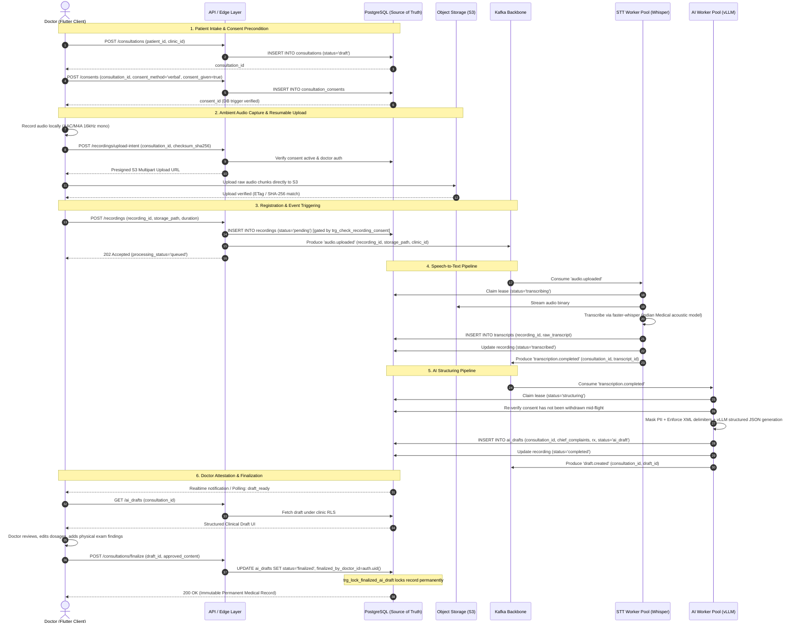

# MEDICO-OPD — PRODUCTION SYSTEM ARCHITECTURE

## Block 0: Architectural Blueprint & 500-Doctor System Design

```
Document Version : 1.0.0
Status           : APPROVED (BLOCK 0 BASELINE)
Target Audience  : Medico-OPD Engineering, Infrastructure, Security & Compliance Teams
Classification   : Confidential — Medical Platform Architecture
```

---

## 1. Project Identity & Scope Boundaries

### 1.1 Project Identity
This is **Medico-OPD**, a dedicated, production-grade outpatient clinical documentation assistant tailored for medical doctors operating private clinics, nursing homes, and outpatient departments (OPDs) in India.

> [!IMPORTANT]
> **Strict Isolation Notice**: Medico-OPD is **NOT** the separate Medico Hospital Management System (HMS) project.
> Under no circumstances may architecture, modules, assumptions, database schemas, code, or enterprise HMS dependencies (e.g. inpatient bed allocation, hospital-wide billing, pharmacy dispensary inventory, operating theater scheduling) be imported into Medico-OPD unless explicitly mandated.

### 1.2 Objective & Capacity Scope
The objective of Block 0 is to design and document the production architecture capable of supporting an initial operational target of **500 active doctors** with smooth, horizontal scalability to thousands of doctors without requiring an architectural rewrite or database replatforming.

Block 0 is strictly an **architecture and capacity-modeling block**. It establishes contracts, bounds, failure strategies, and scaling matrices. It does **not** implement Kafka, Redis clusters, self-hosted GPU pools, vLLM, or database sharding. Those are scheduled for later engineering blocks.

---

## 2. High-Level Target Architecture

The Medico-OPD production architecture decouples user-facing interactive clinic workflows from high-latency, compute-heavy Speech-to-Text (STT) and Large Language Model (LLM) inference pipelines.

```
                              +---------------------------------------+
                              |      Flutter Android / iOS Client     |
                              |  (Dr. Device / Offline-First Engine)  |
                              +---------------------------------------+
                                    |                         |
               1. Interactive CRUD  |                         | 2. Direct S3 Upload
               & Token Session Auth |                         |    (Encrypted Audio)
                                    v                         v
                           +------------------+    +----------------------+
                           | API / Edge Layer |    | S3-Compatible Storage|
                           | (Auth, RLS Gate, |    | (Private S3 Bucket / |
                           |  Rate Limiting)  |    |  SSE-S3 Encryption)  |
                           +------------------+    +----------------------+
                                |        |                    |
        +-----------------------+        |                    |
        | Read/Write State               | Ephemeral Cache    | Storage Webhook /
        v                                v & Fast Locks       | Upload Complete
+--------------------+           +---------------+            |
| PostgreSQL Cluster |           | Redis Cluster |            |
| (Source of Truth)  |           | (Non-Authori- |            |
| Master + Read Reps |           |  tative Cache)|            |
+--------------------+           +---------------+            |
        |                                                     |
        | 3. CDC / Transactional Outbox                       |
        +----------------------------+                        |
                                     |                        |
                                     v                        v
                            +-------------------------------------+
                            |         Kafka Event Backbone        |
                            |   (Durable Distributed Event Log)   |
                            +-------------------------------------+
                                       |              |
                audio.uploaded event   |              | transcription.completed
                                       v              v
                            +---------------+   +---------------+
                            |   STT Pool    |   |    AI Pool    |
                            | faster-whisper|   |     vLLM      |
                            | (GPU Workers) |   | (GPU Workers) |
                            +---------------+   +---------------+
                                       |              |
              transcription.completed  |              | ai.draft.generated
                                       +-------+------+
                                               |
                                               v
                                    +--------------------+
                                    | PostgreSQL Cluster |
                                    | (Source of Truth)  |
                                    +--------------------+
                                               |
                                               | Server-Sent Events /
                                               | PostgREST Realtime Polling
                                               v
                                    +----------------------+
                                    | Flutter Client UI    |
                                    | (AI Draft for Review)|
                                    +----------------------+
```

---

## 3. Core Architectural Principles

### 3.1 Principle 1: PostgreSQL is the Sole Authoritative Source of Truth
* **Rule**: Neither Redis, Kafka, object storage, nor AI worker memory is authoritative for clinical, administrative, or legal state.
* **Guarantee**: In the event of a total cluster reset or catastrophic infrastructure crash, the complete business and clinical state must be fully recoverable from PostgreSQL write-ahead logs (WAL) and backups.
* **Implementation**: Consultation state, consent status, doctor attestation, audit records, and draft revisions live permanently in PostgreSQL under Row-Level Security (RLS).

### 3.2 Principle 2: Object Storage for Large Binary Blobs
* **Rule**: Large binary artifacts—specifically raw audio recordings, preprocessed audio chunks, and generated clinical PDF exports—must **never** be stored as `BYTEA` or `BLOB` inside PostgreSQL.
* **Storage Abstraction**: Audio objects reside in private, encrypted S3-compatible object storage (`consultation-recordings`).
* **Database Role**: PostgreSQL stores only metadata, canonical storage paths, SHA-256 checksums, encryption key references, duration, ownership, and lifecycle deletion timestamps.
* **Retention Policy**: The 7-day raw audio auto-purge policy is **architecturally modeled** to reconcile DPDP Act data minimization with NMC statutory records. It is **subject to formal legal approval (RLR-02)**, and its production operational enforcement belongs to the appropriate future block.

### 3.3 Principle 3: Kafka is Asynchronous Infrastructure
* **Rule**: Kafka must not become a substitute for database transactions or consistency guarantees.
* **Role**: Kafka serves as an append-only, durable event streaming backbone that decouples the API edge from the asynchronous worker pools.
* **Correctness**: Event ordering and delivery are asynchronous. Business rules and idempotency are enforced at consumer commit boundaries via PostgreSQL check-and-set or unique constraints.

### 3.4 Principle 4: Redis is Strictly Non-Authoritative
* **Rule**: Redis is an ephemeral acceleration layer. It is used exclusively for rate limiting, distributed lock leases, cache warmups, and transient pipeline coordination.
* **Resilience**: The system must remain correct, secure, and operational if Redis becomes completely unavailable (graceful degradation to PostgreSQL row locks and direct database reads).

### 3.5 Principle 5: Horizontally Scalable Worker Pools
* **Rule**: Never build workflows around a single monolithic server, one Whisper process, or a singular LLM endpoint.
* **Worker Design**: All STT workers (`faster-whisper`) and LLM inference workers (`vLLM`) are stateless consumers that pull jobs from Kafka partitions or atomic database queues, scale horizontally with queue depth, and can be terminated without data loss.

### 3.6 Principle 6: Transactional Outbox for Asynchronous Kafka Publication
* **Rule**: Kafka event publication must not rely on fragile application dual-writes. Event emission is coupled directly to the authoritative PostgreSQL transaction.
* **Conceptual Flow**:
  ```
  Business Transaction
          ↓
  PostgreSQL state change + Outbox Event
          ↓
  Atomic DB Commit
          ↓
  Outbox Publisher (CDC / Relational Poller)
          ↓
  Kafka Cluster
          ↓
  Downstream Consumers (STT / LLM Pools)
  ```
* **Failure Guarantee**: If the PostgreSQL commit succeeds but Kafka publication fails or Kafka is temporarily offline, the event remains durable and recoverable within PostgreSQL outbox state. Once Kafka connectivity restores, the outbox publisher replays unacknowledged events.
* **Block 0 Boundary**: This is an **architectural decision only** (see [ADR-0007](adr/ADR-0007-transactional-outbox-for-kafka-publication.md)). The outbox table, publisher daemon, and Kafka cluster are **NOT implemented in Block 0**. Implementation belongs to the future backend event streaming block.

---

## 4. System Components & Responsibilities

| Component | Technology | Primary Responsibilities | Stateless? | High Availability Target |
| :--- | :--- | :--- | :---: | :--- |
| **Mobile Client** | Flutter (Android/iOS) | Audio capture (16kHz AAC), local encrypted buffer, crash recovery, consent UX, structured draft review, doctor digital signature. | No (Local sandbox) | Offline-capable |
| **API / Edge Layer** | PostgREST / Deno Edge / Go API | JWT verification, RLS enforcement, presigned URL generation, synchronous consultation CRUD, client request validation. | Yes | Active-Active Multi-AZ |
| **Object Storage** | S3-Compatible (MinIO / Supabase S3) | Storage of raw encrypted audio (`.m4a`), envelope DEKs, lifecycle auto-purge enforcement, presigned multipart upload targets. | No (Clustered S3) | 99.999999999% (11 9s) |
| **Database** | PostgreSQL 16+ (Timescale / RLS) | Master clinical ledger, relational models, multi-tenant RLS, transactional outbox, immutable audit trails, optimistic locks. | No (Primary-Replica) | Primary + Sync Replica |
| **Cache & Locks** | Redis Cluster (Sentinel / Valkey) | Rate-limiting sliding windows, transient doctor dashboard cache, distributed lock lease coordination, session blacklists. | Yes (Ephemeral) | Sentinel / Multi-Replica |
| **Event Backbone** | Apache Kafka | Durable message broker, decoupling API from STT/AI pools, event replay, guaranteed per-consultation partition ordering. | No (Durable Log) | 3-Broker Cluster (ISR >= 2) |
| **STT Worker Pool** | Python `faster-whisper` (CUDA) | Audio decoding, silence removal, multi-language speech transcription (Indian English, Hindi, Hinglish), confidence scoring. | Yes | Horizontal Worker Scale |
| **AI Worker Pool** | Python `vLLM` / Open-Weights | Structured clinical entity extraction, prompt injection sanitization, prescription parsing, JSON validation against clinical schema. | Yes | Horizontal Worker Scale |

---

## 5. End-to-End Data Flow



---

## 6. Communication Boundaries

### 6.1 Synchronous vs Asynchronous Boundaries
To ensure that mobile network fluctuations do not lock doctor workflows or create server connection exhaustion, boundaries are strictly enforced:

* **Synchronous (Request-Response, Low-Latency)**:
  * Authentication, session validation, token refresh (`< 150 ms`).
  * Doctor clinic profile retrieval, patient search, patient registration (`< 300 ms`).
  * Consultation creation, draft status transitions (`< 300 ms`).
  * S3 upload URL initiation and completion handshake (`< 250 ms`).
  * Clinical draft fetch, interactive draft edits, final doctor attestation (`< 400 ms`).
* **Asynchronous (Decoupled, Event-Driven, Background)**:
  * Audio file upload from mobile device to S3 (handled via background resumable HTTP transfer).
  * Audio transcription via `faster-whisper` worker pool (15–30 seconds).
  * Clinical note structuring via `vLLM` inference pool (5–12 seconds).
  * Data retention purges and audit log archiving (scheduled cron workers).
  * Push notifications and real-time state delivery (WebSockets / SSE / FCM).

### 6.2 Trust Boundaries
* **Untrusted Zone**:
  * Doctor mobile devices (Android / iOS). Any input from client devices (parameters, payloads, speech audio) is treated as untrusted.
  * Ambient consultation audio: Contains unverified patient statements, background noise, and potential malicious speech.
* **DMZ / Edge Zone**:
  * API Gateway / Reverse Proxy: Terminates TLS 1.3, enforces IP/token rate limits, authenticates Supabase JWTs, rejects malformed payloads.
* **Trusted Core Zone**:
  * PostgreSQL database, Redis cluster, Kafka broker network, internal Docker/worker networks.
  * Only authenticated internal workers with mutual TLS or isolated VPC networking can communicate with database primaries and Kafka brokers.
* **AI Untrusted Input Sandbox**:
  * Transcripts are enclosed in strict XML delimiter tags (`<patient_doctor_transcript>`) to prevent prompt injection from executing instructions embedded in spoken conversation.

### 6.3 Failure Boundaries
* A failure in the STT worker pool or Kafka broker does **not** take down doctor logins, patient search, or manual consultation note entry.
* A complete failure or network partition of Redis causes transparent failover to PostgreSQL database locks without rejecting doctor API transactions.
* An upload failure mid-recording preserves the local audio file in the doctor's device sandbox and presents an interactive retry wizard on app resume.

---

## 7. Multi-Tenancy Architecture

Even though the initial target is 500 doctors, Medico-OPD enforces multi-tenant isolation from day one.

```
Tenant Boundary: Clinic (clinic_id UUID)
    ├── Doctor Boundary: Doctor (doctor_id UUID, linked to auth.users)
    │     └── Consultation Ownership: (doctor_id, clinic_id)
    └── Patient Ownership: (clinic_id)
```

### 7.1 Tenant & Doctor Identity
* **Tenant Identity**: `clinic_id` (UUID). The clinic is the top-level data controller. All patients, consultations, audio objects, and drafts are partitioned by `clinic_id`.
* **Doctor Identity**: `doctor_id` (UUID) linked 1:1 with Supabase `auth.users(id)`. A doctor is an authorized actor operating within a clinic.
* **Cross-Doctor Access**: Within a single clinic, doctors can access and cross-cover consultations created by colleagues. Access across different clinics is cryptographically and logically prohibited.

### 7.2 Database Isolation Strategy
* **Shared Database, Shared Schema with Row-Level Security (RLS)**:
  * Every clinical table (`patients`, `consultations`, `consultation_consents`, `recordings`, `transcripts`, `ai_drafts`, `audit_logs`) has a mandatory `clinic_id UUID NOT NULL` column.
  * Deny-by-default RLS: `CREATE POLICY ON table FOR ALL TO authenticated USING (clinic_id = public.get_auth_clinic_id());`.
  * Column-Level Privilege Grants: Column update privileges on immutable foreign keys (`clinic_id`, `created_by`, `doctor_id`, `patient_id`) are revoked from the `authenticated` role, preventing tenant-hopping via client updates.
  * Consistency Triggers: `BEFORE INSERT OR UPDATE` triggers verify that a consultation's `doctor_id` and `patient_id` belong to the same `clinic_id` as the consultation.

### 7.3 Object Storage Isolation Strategy
* Storage paths in the private S3 bucket follow a deterministic hierarchy:
  `clinics/{clinic_id}/consultations/{consultation_id}/{recording_id}.m4a`
* Storage RLS policies extract path segment index `[2]` (`(storage.foldername(name))[2] = (public.get_auth_clinic_id())::text`), preventing cross-clinic download or overwrite attempts.

---

## 8. Mobile Client Architecture & Resilience Contract

The Flutter mobile client operates in environments with intermittent 4G/5G and clinic Wi-Fi. It **never assumes permanent connectivity**.

### 8.1 Offline & Disconnection Guarantees
1. **Ongoing Recording Resilience**:
   * Microphone capture writes directly to local sandbox storage (`path_provider` application documents directory) as standard AAC/M4A 16kHz mono chunks.
   * If mobile connectivity drops during a consultation, recording continues unaffected. Network is only required during upload.
2. **Crash & Interruption Recovery**:
   * An atomic checkpoint (`InterruptedRecordingCheckpoint`) is written to local SQLite / secure storage on recording initialization.
   * If the app is killed by the OS (out of memory, battery saver) or device shuts down, the app detects uncommitted checkpoints upon restart and displays: *"Interrupted recording recovered for Patient [Name]. Tap to resume upload or discard."*
3. **Resumable & Chunked Upload**:
   * Audio uploads use chunked HTTP multipart protocols with SHA-256 integrity verification.
   * If network drops during upload, the client resumes from the last confirmed byte offset without re-uploading the entire file.
4. **Server-Side Idempotency**:
   * The client generates a cryptographic UUIDv4 `clientRecordingId` before initiating capture.
   * Database insertion uses `createOrGetRecording()` logic (`ON CONFLICT (id) DO NOTHING`), ensuring retry requests after network timeouts return the existing record without duplicate processing.

---

## 9. Horizontal Scaling Model

| Component | Scale-Up Option | Scale-Out Option | Primary Bottleneck | Scaling Trigger | Future Block |
| :--- | :--- | :--- | :--- | :--- | :---: |
| **API / Edge Servers** | Upgrade CPU/RAM (vCPU 2 -> 8) | Add stateless container replicas behind load balancer | Network I/O, concurrent HTTP connections | CPU > 60%, Latency p95 > 400ms | Block 2 |
| **PostgreSQL** | Upgrade compute (8 vCPU / 32GB -> 32 vCPU / 128GB, NVMe SSD) | Read replicas for dashboard/search queries; connection pooling | Connection exhaustion, write locks on `recordings` | Conn pool > 80%, Write IOPS > 70% | Block 1 / Block 5 |
| **Redis** | Upgrade RAM (1GB -> 16GB) | Redis Cluster with master-replica shards | Memory capacity, single-threaded CPU | Memory > 75%, CPU > 80% | Block 2 |
| **Kafka Brokers** | Expand disk volume, add broker RAM | Add brokers to cluster (3 -> 5 -> 7), rebalance partitions | Disk I/O throughput, partition rebalancing | Disk I/O > 70%, Broker CPU > 65% | Block 3 |
| **Kafka Consumers** | Increase consumer thread count | Scale consumer pods up to matching topic partition count | Deserialization CPU, downstream database throughput | Consumer group lag > 20 messages | Block 3 |
| **STT Workers** | Upgrade GPU instance (T4 -> A10G / L40S) | Spin up additional stateless worker pods subscribing to Kafka | GPU VRAM, CUDA audio decoding throughput | STT queue wait time > 30s | Block 4 |
| **LLM Workers** | Upgrade GPU instance (A10G -> A100 / H100) | Spin up additional vLLM replica instances behind internal router | GPU KV-cache VRAM memory, token generation latency | vLLM queue latency > 15s | Block 4 |
| **Object Storage** | Expand underlying volume storage | Distributed S3 cluster (MinIO distributed / AWS S3) | Network egress/ingress bandwidth | Storage IOPS, bucket rate limits | Block 1 / Block 5 |

---

## 10. Single Points of Failure (SPOFs) & HA Audit

To avoid false claims of high availability, the infrastructure state is formally classified:

```
[ CRITICAL SPOF AUDIT — BLOCK 0 BASELINE ]
```

1. **PostgreSQL Primary Database**:
   * *Current State*: Single master instance.
   * *SPOF Risk*: **HIGH**. If primary database crashes, all write traffic (consultations, recordings, auth) stops.
   * *Target Architecture*: Primary + Synchronous Standby with automated patroni/Supavisor failover in separate availability zones.
2. **Object Storage (Audio Binaries)**:
   * *Current State*: Single managed storage bucket.
   * *SPOF Risk*: **MEDIUM**. Cloud provider handles internal disk redundancy, but regional outage halts audio uploads.
   * *Target Architecture*: Multi-AZ replicated S3 storage bucket with cross-region disaster recovery replication.
3. **API / Edge Layer**:
   * *Current State*: Supabase Edge Functions / Serverless gateway.
   * *SPOF Risk*: **LOW**. Natively distributed across cloud edge availability zones.
4. **Kafka Event Backbone (Target)**:
   * *SPOF Risk*: **LOW if clustered**. Minimum 3 brokers with Replication Factor = 3, `min.insync.replicas = 2`. Any single broker failure results in zero message loss and seamless partition leader election.
5. **Redis Cache (Target)**:
   * *SPOF Risk*: **LOW to NONE**. Redis is strictly non-authoritative. If Redis dies, the system gracefully degrades to direct PostgreSQL queries.
6. **STT & LLM Worker Pools (Target)**:
   * *SPOF Risk*: **LOW**. Stateless worker pools behind Kafka consumer groups. If a worker pod crashes mid-job, Kafka consumer group rebalances, the lease expires in PostgreSQL, and a peer worker picks up the job.

---

## 11. Comprehensive Failure Matrix

| Component | Failure Scenario | User / Doctor Impact | Data Loss Risk | Recovery & Failover Strategy | Component Owner |
| :--- | :--- | :--- | :---: | :--- | :--- |
| **PostgreSQL** | Primary node crashes / hardware failure | APIs return 500; mobile client cannot save consultations or sign in | **ZERO** (RPO < 1s via WAL replication) | Automatic standby promotion via Patroni / cloud HA orchestrator. App queues locally. | Database Lead |
| **Redis** | Node crashes or memory exhaustion | Minor latency increase (p95 +50ms) as cache misses hit DB; locks fall back to DB | **ZERO** (Ephemeral data only) | System automatically bypasses Redis cache; queries read directly from PostgreSQL; Redis auto-restarts. | Backend Platform |
| **Kafka** | Single broker crashes in 3-broker cluster | Zero user impact; temporary 1-2s producer pause during partition leader rebalance | **ZERO** (ISR = 2, RF = 3) | Surviving brokers elect new partition leaders; workers continue consuming without interruption. | Data Infrastructure |
| **Kafka** | Entire Kafka cluster becomes unreachable | Audio processing delays; AI drafts not generated immediately | **ZERO** (Jobs backed up in PostgreSQL `recordings` with `status='pending'`) | Mobile app informs doctor: *"Draft generation queued"*; transactional outbox in PostgreSQL retains jobs until Kafka returns. | Data Infrastructure |
| **Object Storage**| S3 upload endpoint unreachable | Doctor cannot complete audio upload; recording stays on phone | **ZERO** (Audio saved locally in client sandbox) | Mobile client pauses upload; displays retry indicator; background worker retries when connectivity returns. | Mobile / Storage Lead |
| **STT Worker** | Worker crashes / OOM mid-audio transcription | Processing delay of ~30-60s for that consultation | **ZERO** (Audio preserved in S3; job preserved in Kafka/DB) | Processing lease expires in PostgreSQL (`lease_expires_at < now()`); peer worker reclaims job via atomic claim RPC. | ML Infrastructure |
| **LLM Worker** | Worker hangs or returns invalid JSON schema | AI draft generation delayed; error logged | **ZERO** (Transcript safe in DB; original audio safe in S3) | Job retried with exponential backoff (up to `max_attempts = 3`); if unrecoverable, marked `failed` with manual retry button for doctor. | AI / Backend Lead |
| **Mobile Client** | Device loses internet during consultation recording | **NONE**. Doctor records ambient audio seamlessly | **ZERO** (Audio captured locally to device disk) | Client detects offline state; suppresses upload until connection restores; prompts doctor when online. | Mobile Lead |
| **Mobile Client** | Device loses internet during audio upload | Upload pauses; doctor sees *"Upload paused — retrying"* | **ZERO** (Local file retained) | Resumable chunked upload resumes from byte offset once network restores. | Mobile Lead |
| **Mobile Client** | App killed by OS / battery dead mid-recording | Recording abruptly stops | **< 15 seconds** (Periodic disk buffer flush) | On reboot, `RecordingRecoveryService` detects unclosed checkpoint; doctor prompted to save or resume. | Mobile Lead |
| **Network** | Doctor switches from Wi-Fi to 4G mid-upload | Brief socket reset | **ZERO** | HTTP client automatically re-establishes connection using exponential backoff and idempotency headers. | Mobile Lead |
| **API Gateway** | Duplicate request sent due to network retry | **NONE**. Second request receives identical response | **ZERO** | Client-generated UUIDv4 idempotency key matches existing DB row; idempotent return without re-execution. | Backend Lead |
| **Worker Pool** | Duplicate Kafka message / worker processes job twice | **NONE**. No duplicate draft or transcript created | **ZERO** | Transcripts have `UNIQUE(recording_id)` constraint; drafts have optimistic locking revision; duplicate writes rejected. | Backend / ML Lead |

---

## 12. Capacity Headroom & Overload Engineering

Designing for a 500-doctor initial capacity requires that infrastructure operate comfortably below saturation thresholds:

* **Target Peak Utilization**: The system is engineered to operate at **< 40% CPU/GPU/IOPS utilization** under Normal operating conditions.
* **Scaling Threshold**: Auto-scaling policies trigger when sustained utilization crosses **65%** for > 3 minutes.
* **Emergency Headroom (Surge Capacity)**:
  * The system maintains **2.5x to 3x headroom** between Normal peak load and maximum cluster capacity.
  * In the event of a sudden 300% surge (e.g., epidemic spike, regional seasonal OPD rush), the Kafka queue absorbs spikes without dropping requests or crashing API servers.
* **Graceful Degradation Under Extreme Overload**:
  1. *Priority 1*: Preserve active doctor logins, patient search, and manual consultation entry (synchronous DB path).
  2. *Priority 2*: Accept audio uploads into S3 and acknowledge receipt to doctor (`status='queued'`).
  3. *Priority 3*: Queue STT and AI processing in Kafka. If queue wait time exceeds 2 minutes, update mobile UI to state: *"High clinic volume — AI draft will appear in your queue in ~3 minutes"*, allowing doctor to proceed to the next patient without blocking.

---

## 13. Canonical Roadmap & Next Block Recommendation

The Medico-OPD engineering roadmap is structured sequentially:
* **Block 00**: Architecture + 500 Doctor Capacity Model (Current Block — Completed)
* **Block 01**: Mobile Recording State
* **Block 02**: Android Recording Resilience
* **Block 03**: iOS Recording Resilience
* **Block 04**: Resumable Upload
* **Block 05**: PostgreSQL Production Audit

### Next Block Recommendation:
**Next: Block 1 — Mobile Recording State**

*Scope*: Implement and harden the Flutter mobile client recording state machine, active session lifecycle, local sandbox buffering, and non-blocking doctor UI states prior to native platform-specific background service integrations.

